# 2023年数据库实践课程报告

> 21301021 肖斌

## 项目2：SQL Parser

> 项目位置：`/codes/sql-parsing`

### 1. 理解

#### > 编译原理概述

忽略掉预处理以及链接的部分，C/C++ 语言的完整编译过程可以用下图表示：

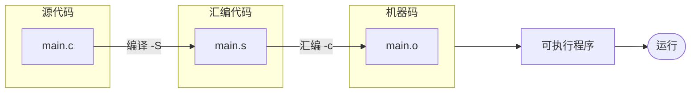
```mermaid
flowchart LR
	subgraph 源代码
        A[main.c]
    end
    
	subgraph 汇编代码
        C[main.s]
    end
    
    A --编译 -S--> C
    
	subgraph 机器码
        D[main.o]
    end
    
    C --汇编 -c--> D
    
	机器码 ---> 可执行程序
	可执行程序 --> z([运行])
```

编译原理中的“编译”二字与此处的“编译”二字并不是一个意思，此处的编译是具体的过程，从源代码到最终的可执行程序，而编译原理中的“编译”更加广泛，一切与解析某一种语言并转化为其他“语言”有关的过程都离不开此原理。

比如 python 的解释器（解释 python 代码并转化为具体指令运行），Markdown的解析渲染（解析 Markdown 并转化为 HTML 进行渲染），以及 SQL 的解析执行（解析 SQL 语句为具体的操作并执行）等等。

而这些过程都可以大致抽象为两大部分：

- 前端部分（Frontend）

  负责将源代码经过一步步分析转化为一个抽象的树形结构 —— 抽象语法树（AST）

- 后端部分（Backend）

  可能是个代码生成器，依照抽象的树形结构生成具体实际的转化目标的指令或语言等

  或许还会包含优化器等部分

---

**编译器（compiler）**的前端部分的主要工作流程如下：

- **词法分析（lexical analysis）**

  将 **字符序列** 转换为 **记号（token）序列**

- **语法分析（syntactic analysis，也叫 parsing）**

  根据某种给定的 **文法** 由 **记号（token）序列** 得到其对应语法结构（语法分析树、抽象语法树等）

- **语义分析（semnatic analysis）**

  筛选出需要根据上下文来找出的错误，比如是否有在使用前未定义的变量、赋值语句类型是否匹配等等

经过这三步筛选与解析，只有合法的程序才能够通过并传递到代码生成器（后端部分）。

#### > flex & bison

**flex** 是一个用于生成基于 C/C++ 的 **词法分析器** 的程序。

它的输入是一个 `.flex`（`.l`） 文件，其中包含着一对对由 **正则表达式** 和 **C 语言代码** 组成的 **规则**。

它的输出是一个 C 语言源文件，其中会包含一个 `yylex()` 函数，该函数会对输入的字符序列进行扫描，根据 **规则** 中的一个个 **正则表达式** 进行匹配并执行其对应的 **C 语言代码**。

**bison** 是一个用于生成基于 C/C++ 的 **语法分析器** 的程序。

它的输入是一个 `.yacc`（`.y`）文件，其中包含着对一系列文法的描述，以及对于解析出的不同文法执行不同的代码，每一个 token 会与一个指定类型的值进行绑定，便于后续处理，同时也可以指定不同 token 的左右结合性及优先级。

这儿者可以相互配合实现完整的 **词法分析** 和 **语法分析** 的工作。

### 2. 表达式计算

> `code/sql-parsing/calc`

#### > 代码讲解

`calc.l`

```c
%option noyywrap
%{
#include "calc.tab.h"
%}
%%
[0-9]+ { yylval = atoi(yytext); return NUMBER; }
[0-9]*"."[0-9]+ { yylval = atof(yytext); return NUMBER; }

[-+*/%=()] { return yytext[0]; }

sin { return SIN; }

. ;
%%

```

`calc.y`

```c
%{
#include <math.h>
#include <stdio.h>
int yylex (void);
void yyerror (char *);

%}
%define api.value.type {double}

%token NUMBER

%token SIN
%left '-' '+'
%left '*' '/' '%'
%precedence NEG   /* negation--unary minus */
%right '^'        /* exponentiation */

%%

input: %empty
     | input line
     ;

line: exp '='  { printf ("\t%lf\n", $1); }

exp:
  NUMBER
| exp '+' exp        { $$ = $1 + $3;      }
| exp '-' exp        { $$ = $1 - $3;      }
| exp '*' exp        { $$ = $1 * $3;      }
| exp '%' exp        { if ($3 == 0) yyerror("division by zero"); $$ = (int)$1 % (int)$3;      }
| exp '/' exp        { if ($3 == 0) yyerror("division by zero"); $$ = $1 / $3;      }
| '-' exp  %prec NEG { $$ = -$2;          }
| exp '^' exp        { $$ = pow($1, $3); }
| '(' exp ')'        { $$ = $2;           }
| SIN '(' exp ')'   { $$ = sin($3); }
;

%%
#include <math.h>

void yyerror(char *s) {
  fprintf(stderr, s);
  fprintf(stderr, "\n");
}

int main() {
    return yyparse();
}

```

在 flex 文件中定义了 `NUMBER`，`+`，`-`，`*`，`/`，`%`，`=`，`(`，`)`，`SIN` 这几个 token，

在 bison 文件中指定 各 token 与 `double` 类型值进行绑定，并定义了 `exp`，`line` 和 `input` 三个语法，`exp` 可以是单独的 `NUMBER` 也可以是 `exp` 的运算，对应的匹配会计算对应表达式的值并赋给当前的 `exp`，最终遇到 `=` 输出。

#### > 效果展示

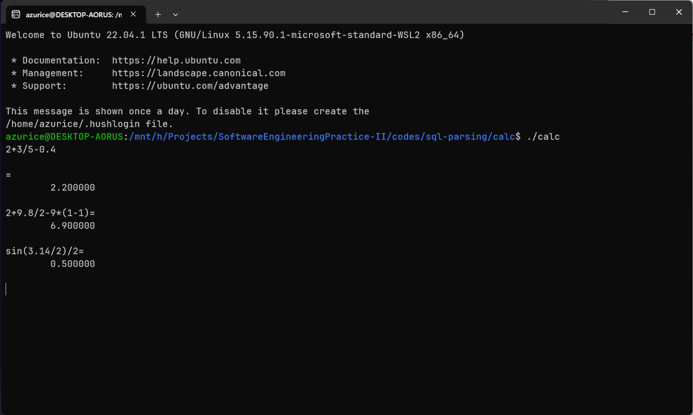

### 3. SQL 解析

> `code/sql-parsing/sql-parser-full`

代码修改自 [hurdad/pmysql: bison & flex sql parser (github.com)](https://github.com/hurdad/pmysql)（原书代码）

#### > 代码讲解

`sql-parser.l`

```c
/*
 * Scanner for mysql subset
 * $Header: /usr/home/johnl/flnb/RCS/ch04.tr,v 1.7 2009/05/19 18:28:27 johnl Exp $
 */

%option noyywrap nodefault yylineno case-insensitive
%{
#include "sql-parser.tab.h"
#include <stdarg.h>
#include <string.h>

void yyerror(char *s, ...);

int oldstate;

%}

%x COMMENT
%s BTWMODE

%%

	/* keywords */
ADD     { return ADD; }
ALL     { return ALL; }
ALTER   { return ALTER; }
ANALYZE { return ANALYZE; }

  /* Hack for BETWEEN ... AND ... 
   * return special AND token if BETWEEN seen
   */
<BTWMODE>AND    { BEGIN INITIAL; return AND; }
AND     { return ANDOP; }
ANY     { return ANY; }
AS      { return AS; }
ASC     { return ASC; }
AUTO_INCREMENT  { return AUTO_INCREMENT; }
BEFORE  { return BEFORE; }
BETWEEN { BEGIN BTWMODE; return BETWEEN; }
INT8|BIGINT     { return BIGINT; }
BINARY  { return BINARY; }
BIT     { return BIT; }
BLOB    { return BLOB; }
BOTH    { return BOTH; }
BY      { return BY; }
CALL    { return CALL; }
CASCADE { return CASCADE; }
CASE    { return CASE; }
CHANGE  { return CHANGE; }
CHAR(ACTER)?    { return CHAR; }
CHECK   { return CHECK; }
COLLATE { return COLLATE; }
COLUMN  { return COLUMN; }
COMMENT { return COMMENT; }
CONDITION       { return CONDITION; }
CONSTRAINT      { return CONSTRAINT; }
CONTINUE        { return CONTINUE; }
CONVERT { return CONVERT; }
CREATE  { return CREATE; }
CROSS   { return CROSS; }
CURRENT_DATE    { return CURRENT_DATE; }
CURRENT_TIME    { return CURRENT_TIME; }
CURRENT_TIMESTAMP       { return CURRENT_TIMESTAMP; }
CURRENT_USER    { return CURRENT_USER; }
CURSOR  { return CURSOR; }
DATABASE        { return DATABASE; }
DATABASES       { return DATABASES; }
DATE    { return DATE; }
DATETIME        { return DATETIME; }
DAY_HOUR        { return DAY_HOUR; }
DAY_MICROSECOND { return DAY_MICROSECOND; }
DAY_MINUTE      { return DAY_MINUTE; }
DAY_SECOND      { return DAY_SECOND; }
NUMERIC|DEC|DECIMAL     { return DECIMAL; }
DECLARE { return DECLARE; }
DEFAULT { return DEFAULT; }
DELAYED { return DELAYED; }
DELETE  { return DELETE; }
DESC    { return DESC; }
DESCRIBE        { return DESCRIBE; }
DETERMINISTIC   { return DETERMINISTIC; }
DISTINCT        { return DISTINCT; }
DISTINCTROW     { return DISTINCTROW; }
DIV     { return DIV; }
FLOAT8|DOUBLE   { return DOUBLE; }
DROP    { return DROP; }
DUAL    { return DUAL; }
EACH    { return EACH; }
ELSE    { return ELSE; }
ELSEIF  { return ELSEIF; }
END     { return END; }
ENUM { return ENUM; }
ESCAPED { return ESCAPED; }
EXISTS  { yylval.subtok = 0; return EXISTS; }
NOT[ \t\n]+EXISTS       { yylval.subtok = 1; return EXISTS; }
EXIT    { return EXIT; }
EXPLAIN { return EXPLAIN; }
FETCH   { return FETCH; }
FLOAT4? { return FLOAT; }
FOR     { return FOR; }
FORCE   { return FORCE; }
FOREIGN { return FOREIGN; }
FROM    { return FROM; }
FULLTEXT        { return FULLTEXT; }
GRANT   { return GRANT; }
GROUP   { return GROUP; }
HAVING  { return HAVING; }
HIGH_PRIORITY   { return HIGH_PRIORITY; }
HOUR_MICROSECOND        { return HOUR_MICROSECOND; }
HOUR_MINUTE     { return HOUR_MINUTE; }
HOUR_SECOND     { return HOUR_SECOND; }
IF      { return IF; }
IGNORE  { return IGNORE; }
IN      { return IN; }
INFILE  { return INFILE; }
INNER   { return INNER; }
INOUT   { return INOUT; }
INSENSITIVE     { return INSENSITIVE; }
INSERT  { return INSERT; }
INT4?|INTEGER   { return INTEGER; }
INTERVAL        { return INTERVAL; }
INTO    { return INTO; }
IS      { return IS; }
ITERATE { return ITERATE; }
JOIN    { return JOIN; }
INDEX|KEY       { return KEY; }
KEYS    { return KEYS; }
KILL    { return KILL; }
LEADING { return LEADING; }
LEAVE   { return LEAVE; }
LEFT    { return LEFT; }
LIKE    { return LIKE; }
LIMIT   { return LIMIT; }
LINES   { return LINES; }
LOAD    { return LOAD; }
LOCALTIME       { return LOCALTIME; }
LOCALTIMESTAMP  { return LOCALTIMESTAMP; }
LOCK    { return LOCK; }
LONG    { return LONG; }
LONGBLOB        { return LONGBLOB; }
LONGTEXT        { return LONGTEXT; }
LOOP    { return LOOP; }
LOW_PRIORITY    { return LOW_PRIORITY; }
MATCH   { return MATCH; }
MEDIUMBLOB      { return MEDIUMBLOB; }
MIDDLEINT|MEDIUMINT     { return MEDIUMINT; }
MEDIUMTEXT      { return MEDIUMTEXT; }
MINUTE_MICROSECOND      { return MINUTE_MICROSECOND; }
MINUTE_SECOND   { return MINUTE_SECOND; }
MOD     { return MOD; }
MODIFIES        { return MODIFIES; }
NATURAL { return NATURAL; }
NOT     { return NOT; }
NO_WRITE_TO_BINLOG      { return NO_WRITE_TO_BINLOG; }
NULL    { return NULLX; }
NUMBER  { return NUMBER; }
ON      { return ON; }
ON[ \t\n]+DUPLICATE { return ONDUPLICATE; } /* hack due to limited lookahead */
OPTIMIZE        { return OPTIMIZE; }
OPTION  { return OPTION; }
OPTIONALLY      { return OPTIONALLY; }
OR      { return OR; }
ORDER   { return ORDER; }
OUT     { return OUT; }
OUTER   { return OUTER; }
OUTFILE { return OUTFILE; }
PRECISION       { return PRECISION; }
PRIMARY { return PRIMARY; }
PROCEDURE       { return PROCEDURE; }
PURGE   { return PURGE; }
QUICK   { return QUICK; }
READ    { return READ; }
READS   { return READS; }
REAL    { return REAL; }
REFERENCES      { return REFERENCES; }
REGEXP|RLIKE    { return REGEXP; }
RELEASE { return RELEASE; }
RENAME  { return RENAME; }
REPEAT  { return REPEAT; }
REPLACE { return REPLACE; }
REQUIRE { return REQUIRE; }
RESTRICT        { return RESTRICT; }
RETURN  { return RETURN; }
REVOKE  { return REVOKE; }
RIGHT   { return RIGHT; }
ROLLUP  { return ROLLUP; }
SCHEMA  { return SCHEMA; }
SCHEMAS { return SCHEMAS; }
SECOND_MICROSECOND      { return SECOND_MICROSECOND; }
SELECT  { return SELECT; }
SENSITIVE       { return SENSITIVE; }
SEPARATOR       { return SEPARATOR; }
SET     { return SET; }
SHOW    { return SHOW; }
INT2|SMALLINT   { return SMALLINT; }
SOME    { return SOME; }
SONAME  { return SONAME; }
SPATIAL { return SPATIAL; }
SPECIFIC        { return SPECIFIC; }
SQL     { return SQL; }
SQLEXCEPTION    { return SQLEXCEPTION; }
SQLSTATE        { return SQLSTATE; }
SQLWARNING      { return SQLWARNING; }
SQL_BIG_RESULT  { return SQL_BIG_RESULT; }
SQL_CALC_FOUND_ROWS     { return SQL_CALC_FOUND_ROWS; }
SQL_SMALL_RESULT        { return SQL_SMALL_RESULT; }
SSL     { return SSL; }
STARTING        { return STARTING; }
STRAIGHT_JOIN   { return STRAIGHT_JOIN; }
TABLE   { return TABLE; }
TEMPORARY       { return TEMPORARY; }
TERMINATED      { return TERMINATED; }
TEXT    { return TEXT; }
THEN    { return THEN; }
TIME    { return TIME; }
TIMESTAMP       { return TIMESTAMP; }
INT1|TINYINT    { return TINYINT; }
TINYTEXT        { return TINYTEXT; }
TO      { return TO; }
TRAILING        { return TRAILING; }
TRIGGER { return TRIGGER; }
UNDO    { return UNDO; }
UNION   { return UNION; }
UNIQUE  { return UNIQUE; }
UNLOCK  { return UNLOCK; }
UNSIGNED        { return UNSIGNED; }
UPDATE  { return UPDATE; }
USAGE   { return USAGE; }
USE     { return USE; }
USING   { return USING; }
UTC_DATE        { return UTC_DATE; }
UTC_TIME        { return UTC_TIME; }
UTC_TIMESTAMP   { return UTC_TIMESTAMP; }
VALUES? { return VALUES; }
VARBINARY       { return VARBINARY; }
VARCHAR(ACTER)? { return VARCHAR; }
VARYING { return VARYING; }
WHEN    { return WHEN; }
WHERE   { return WHERE; }
WHILE   { return WHILE; }
WITH    { return WITH; }
WRITE   { return WRITE; }
XOR     { return XOR; }
YEAR    { return YEAR; }
YEAR_MONTH      { return YEAR_MONTH; }
ZEROFILL        { return ZEROFILL; }

	/* numbers */
-?[0-9]+                { yylval.intval = atoi(yytext); return INTNUM; } 

-?[0-9]+"."[0-9]* |
-?"."[0-9]+     |
-?[0-9]+E[-+]?[0-9]+    |
-?[0-9]+"."[0-9]*E[-+]?[0-9]+ |
-?"."[0-9]+E[-+]?[0-9]+ { yylval.floatval = atof(yytext) ;
                                  return APPROXNUM; }
	/* booleans */
TRUE    { yylval.intval = 1; return BOOL; }
UNKNOWN { yylval.intval = -1; return BOOL; }
FALSE   { yylval.intval = 0; return BOOL; }

	/* strings */
'(\\.|''|[^'\n])*'   |
\"(\\.|\"\"|[^"\n])*\"  { yylval.strval = strdup(yytext); return STRING; }

'(\\.|[^'\n])*$      { yyerror("Unterminated string %s", yytext); }
\"(\\.|[^"\n])*$    { yyerror("Unterminated string %s", yytext); }

	/* hex strings */
X'[0-9A-F]+' |  
0X[0-9A-F]+  { yylval.strval = strdup(yytext); return STRING; }

	/* bit strings */
0B[01]+      |
B'[01]+'     { yylval.strval = strdup(yytext); return STRING; }

	/* operators */
[-+&~|^/%*(),.;!]   { return yytext[0]; }

"&&"            { return ANDOP; }
"||"            { return OR; }

"="     { yylval.subtok = 4; return COMPARISON; }
"<=>"   { yylval.subtok = 12; return COMPARISON; }
">="    { yylval.subtok = 6; return COMPARISON; }
">"     { yylval.subtok = 2; return COMPARISON; }
"<="    { yylval.subtok = 5; return COMPARISON; }
"<"     { yylval.subtok = 1; return COMPARISON; }
"!="    |
"<>"    { yylval.subtok = 3; return COMPARISON; }

"<<"    { yylval.subtok = 1; return SHIFT; }
">>"    { yylval.subtok = 2; return SHIFT; }

":="     { return ASSIGN; }

	/* functions */
SUBSTR(ING)?/"(" { return FSUBSTRING; }
TRIM/"("         { return FTRIM; }
DATE_ADD/"("    { return FDATE_ADD; }
DATE_SUB/"("    { return FDATE_SUB; }

	/* check trailing context manually */
COUNT    { int c = input(); unput(c);
           if(c == '(') return FCOUNT;
           yylval.strval = strdup(yytext);
           return NAME; }

	/* names */
[A-Za-z][A-Za-z0-9_]*   { yylval.strval = strdup(yytext);
                          return NAME; }

`[^`/\\.\n]+`           { yylval.strval = strdup(yytext+1);
                          yylval.strval[yyleng-2] = 0;
                          return NAME; }

`[^`\n]*$               { yyerror("unterminated quoted name %s", yytext); }

	/* user variables */
@[0-9a-z_.$]+ |
@\"[^"\n]+\" |
@`[^`\n]+` |
@'[^'\n]+' { yylval.strval = strdup(yytext+1); return USERVAR; }

@\"[^"\n]*$ |
@`[^`\n]*$ |
@'[^'\n]*$ { yyerror("unterminated quoted user variable %s", yytext); }

	/* comments */   
#.*             ;
"--"[ \t].*     ;

"/*"            { oldstate = YY_START; BEGIN COMMENT; }
<COMMENT>"*/"   { BEGIN oldstate; }
<COMMENT>.|\n   ;
<COMMENT><<EOF>> { yyerror("unclosed comment"); }

	/* everything else */
[ \t\n]         /* whitespace */
.               { yyerror("mystery character '%c'", *yytext); }

%%

```

`sql-parser.y`

```c
/*
 * Parser for mysql subset
 * $Header: /usr/home/johnl/flnb/RCS/ch04.tr,v 1.7 2009/05/19 18:28:27 johnl Exp $
 */
%{
#include <stdio.h>
#include <stdlib.h>
#include <stdarg.h>
#include <string.h>

void yyerror(char *s, ...);
void emit(char *s, ...);
%}

%union {
        int intval;
        double floatval;
        char *strval;
        int subtok;
}

/* names and literal values */

%token <strval> NAME
%token <strval> STRING
%token <intval> INTNUM
%token <intval> BOOL
%token <floatval> APPROXNUM

/* user @abc names */

%token <strval> USERVAR

/* operators and precedence levels */

%right ASSIGN
%left OR
%left XOR
%left ANDOP
%nonassoc IN IS LIKE REGEXP
%left NOT '!'
%left BETWEEN
%left <subtok> COMPARISON /* = <> < > <= >= <=> */
%left '|'
%left '&'
%left <subtok> SHIFT /* << >> */
%left '+' '-'
%left '*' '/' '%' MOD
%left '^'
%nonassoc UMINUS

%token ADD
%token ALL
%token ALTER
%token ANALYZE
%token AND
%token ANY
%token AS
%token ASC
%token AUTO_INCREMENT
%token BEFORE
%token BIGINT
%token BINARY
%token BIT
%token BLOB
%token BOTH
%token BY
%token CALL
%token CASCADE
%token CASE
%token CHANGE
%token CHAR
%token CHECK
%token COLLATE
%token COLUMN
%token COMMENT
%token CONDITION
%token CONSTRAINT
%token CONTINUE
%token CONVERT
%token CREATE
%token CROSS
%token CURRENT_DATE
%token CURRENT_TIME
%token CURRENT_TIMESTAMP
%token CURRENT_USER
%token CURSOR
%token DATABASE
%token DATABASES
%token DATE
%token DATETIME
%token DAY_HOUR
%token DAY_MICROSECOND
%token DAY_MINUTE
%token DAY_SECOND
%token DECIMAL
%token DECLARE
%token DEFAULT
%token DELAYED
%token DELETE
%token DESC
%token DESCRIBE
%token DETERMINISTIC
%token DISTINCT
%token DISTINCTROW
%token DIV
%token DOUBLE
%token DROP   
%token DUAL 
%token EACH 
%token ELSE
%token ELSEIF
%token END
%token ENUM
%token EXIT
%token EXPLAIN
%token FETCH
%token FLOAT
%token FOR
%token FORCE
%token FOREIGN
%token FROM
%token FULLTEXT
%token GRANT
%token GROUP
%token HAVING
%token HIGH_PRIORITY
%token HOUR_MICROSECOND 
%token HOUR_MINUTE
%token HOUR_SECOND
%token IF
%token IGNORE
%token INFILE
%token INDEX
%token INNER
%token INOUT
%token INSENSITIVE
%token INSERT
%token INT
%token INTEGER
%token INTERVAL
%token INTO
%token ITERATE
%token JOIN
%token KEY
%token KEYS
%token KILL
%token LEADING
%token LEAVE
%token LEFT
%token LIMIT
%token LINES 
%token LOAD 
%token LOCALTIME 
%token LOCALTIMESTAMP
%token LOCK
%token LONG 
%token LONGBLOB
%token LONGTEXT
%token LOOP
%token LOW_PRIORITY
%token MATCH
%token MEDIUMBLOB
%token MEDIUMINT
%token MEDIUMTEXT
%token MINUTE_MICROSECOND
%token MINUTE_SECOND
%token MODIFIES
%token NATURAL
%token NO_WRITE_TO_BINLOG
%token NULLX
%token NUMBER
%token ON
%token ONDUPLICATE
%token OPTIMIZE
%token OPTION
%token OPTIONALLY
%token ORDER
%token OUT
%token OUTER
%token OUTFILE
%token PRECISION
%token PRIMARY
%token PROCEDURE
%token PURGE
%token QUICK
%token READ
%token READS
%token REAL
%token REFERENCES
%token RELEASE
%token RENAME
%token REPEAT
%token REPLACE
%token REQUIRE 
%token RESTRICT
%token RETURN
%token REVOKE 
%token RIGHT
%token ROLLUP
%token SCHEMA
%token SCHEMAS
%token SECOND_MICROSECOND  
%token SELECT
%token SENSITIVE
%token SEPARATOR
%token SET
%token SHOW
%token SMALLINT
%token SOME
%token SONAME
%token SPATIAL
%token SPECIFIC
%token SQL
%token SQLEXCEPTION
%token SQLSTATE
%token SQLWARNING
%token SQL_BIG_RESULT
%token SQL_CALC_FOUND_ROWS
%token SQL_SMALL_RESULT
%token SSL
%token STARTING
%token STRAIGHT_JOIN
%token TABLE
%token TEMPORARY
%token TERMINATED
%token TEXT
%token THEN
%token TIME
%token TIMESTAMP
%token TINYBLOB
%token TINYINT
%token TINYTEXT
%token TO
%token TRAILING
%token TRIGGER 
%token UNDO
%token UNION
%token UNIQUE
%token UNLOCK
%token UNSIGNED
%token UPDATE
%token USAGE
%token USE
%token USING
%token UTC_DATE
%token UTC_TIME
%token UTC_TIMESTAMP
%token VALUES
%token VARBINARY
%token VARCHAR
%token VARYING
%token WHEN
%token WHERE
%token WHILE
%token WITH
%token WRITE
%token YEAR
%token YEAR_MONTH
%token ZEROFILL

%token ESCAPED
%token <subtok> EXISTS /* NOT EXISTS or EXISTS */

/* functions with special syntax */
%token FSUBSTRING
%token FTRIM
%token FDATE_ADD FDATE_SUB
%token FCOUNT

%type <intval> select_opts select_expr_list
%type <intval> val_list opt_val_list case_list
%type <intval> groupby_list opt_with_rollup opt_asc_desc
%type <intval> table_references opt_inner_cross opt_outer
%type <intval> left_or_right opt_left_or_right_outer column_list
%type <intval> index_list opt_for_join

%type <intval> delete_opts delete_list
%type <intval> insert_opts insert_vals insert_vals_list
%type <intval> insert_asgn_list opt_if_not_exists update_opts update_asgn_list
%type <intval> opt_temporary opt_length opt_binary opt_uz enum_list
%type <intval> column_atts data_type opt_ignore_replace create_col_list

%start stmt_list

%%

stmt_list: stmt ';'
  | stmt_list stmt ';'
  ;
  
/**** expressions ****/
   
expr: NAME         { emit("NAME %s", $1); free($1); }
   | NAME '.' NAME { emit("FIELDNAME %s.%s", $1, $3); free($1); free($3); }
   | USERVAR       { emit("USERVAR %s", $1); free($1); }
   | STRING        { emit("STRING %s", $1); free($1); }
   | INTNUM        { emit("NUMBER %d", $1); }
   | APPROXNUM     { emit("FLOAT %g", $1); }
   | BOOL          { emit("BOOL %d", $1); }
   ;
   
expr: expr '+' expr { emit("ADD"); }
   | expr '-' expr { emit("SUB"); }
   | expr '*' expr { emit("MUL"); }
   | expr '/' expr { emit("DIV"); }
   | expr '%' expr { emit("MOD"); }
   | expr MOD expr { emit("MOD"); }
   | '-' expr %prec UMINUS { emit("NEG"); }
   | expr ANDOP expr { emit("AND"); }
   | expr OR expr { emit("OR"); }
   | expr XOR expr { emit("XOR"); }
   | expr '|' expr { emit("BITOR"); }
   | expr '&' expr { emit("BITAND"); }
   | expr '^' expr { emit("BITXOR"); }
   | expr SHIFT expr { emit("SHIFT %s", $2==1?"left":"right"); }
   | NOT expr { emit("NOT"); }
   | '!' expr { emit("NOT"); }
   | expr COMPARISON expr { emit("CMP %d", $2); }
   | '(' expr ')';

/* recursive selects and comparisons thereto */
   | expr COMPARISON '(' select_stmt ')' { emit("CMPSELECT %d", $2); }
   | expr COMPARISON ANY '(' select_stmt ')' { emit("CMPANYSELECT %d", $2); }
   | expr COMPARISON SOME '(' select_stmt ')' { emit("CMPANYSELECT %d", $2); }
   | expr COMPARISON ALL '(' select_stmt ')' { emit("CMPALLSELECT %d", $2); }
   ;

expr:  expr IS NULLX     { emit("ISNULL"); }
   |   expr IS NOT NULLX { emit("ISNULL"); emit("NOT"); }
   |   expr IS BOOL      { emit("ISBOOL %d", $3); }
   |   expr IS NOT BOOL  { emit("ISBOOL %d", $4); emit("NOT"); }

   | USERVAR ASSIGN expr { emit("ASSIGN @%s", $1); free($1); }
   ;

expr: expr BETWEEN expr AND expr %prec BETWEEN { emit("BETWEEN"); }
   ;
   
val_list: expr { $$ = 1; }
   | expr ',' val_list { $$ = 1 + $3; }
   ;

opt_val_list: /* nil */ { $$ = 0; }
   | val_list
   ;

expr: expr IN '(' val_list ')'       { emit("ISIN %d", $4); }
   | expr NOT IN '(' val_list ')'    { emit("ISIN %d", $5); emit("NOT"); }
   | expr IN '(' select_stmt ')'     { emit("CMPANYSELECT 4"); }
   | expr NOT IN '(' select_stmt ')' { emit("CMPALLSELECT 3"); }
   | EXISTS '(' select_stmt ')'      { emit("EXISTSSELECT"); if($1)emit("NOT"); }
   ;
   
/* regular functions */
expr: NAME '(' opt_val_list ')' {  emit("CALL %d %s", $3, $1); free($1); }
   ;

/* functions with special syntax */
expr: FCOUNT '(' '*' ')' { emit("COUNTALL"); }
   | FCOUNT '(' expr ')' { emit(" CALL 1 COUNT"); } 

expr: FSUBSTRING '(' val_list ')'               {  emit("CALL %d SUBSTR", $3); }
   | FSUBSTRING '(' expr FROM expr ')'          {  emit("CALL 2 SUBSTR"); }
   | FSUBSTRING '(' expr FROM expr FOR expr ')' {  emit("CALL 3 SUBSTR"); }

   | FTRIM '(' val_list ')'                     { emit("CALL %d TRIM", $3); }
   | FTRIM '(' trim_ltb expr FROM val_list ')'  { emit("CALL 3 TRIM"); }
   ;

trim_ltb: LEADING { emit("NUMBER 1"); }
   | TRAILING     { emit("NUMBER 2"); }
   | BOTH         { emit("NUMBER 3"); }
   ;

expr: FDATE_ADD '(' expr ',' interval_exp ')' { emit("CALL 3 DATE_ADD"); }
   |  FDATE_SUB '(' expr ',' interval_exp ')' { emit("CALL 3 DATE_SUB"); }
   ;

interval_exp: INTERVAL expr DAY_HOUR { emit("NUMBER 1"); }
   | INTERVAL expr DAY_MICROSECOND   { emit("NUMBER 2"); }
   | INTERVAL expr DAY_MINUTE        { emit("NUMBER 3"); }
   | INTERVAL expr DAY_SECOND        { emit("NUMBER 4"); }
   | INTERVAL expr YEAR_MONTH        { emit("NUMBER 5"); }
   | INTERVAL expr YEAR              { emit("NUMBER 6"); }
   | INTERVAL expr HOUR_MICROSECOND  { emit("NUMBER 7"); }
   | INTERVAL expr HOUR_MINUTE       { emit("NUMBER 8"); }
   | INTERVAL expr HOUR_SECOND       { emit("NUMBER 9"); }
   ;
expr: CASE expr case_list END           { emit("CASEVAL %d 0", $3); }
   |  CASE expr case_list ELSE expr END { emit("CASEVAL %d 1", $3); }
   |  CASE case_list END                { emit("CASE %d 0", $2); }
   |  CASE case_list ELSE expr END      { emit("CASE %d 1", $2); }
   ;

case_list: WHEN expr THEN expr     { $$ = 1; }
         | case_list WHEN expr THEN expr { $$ = $1+1; }
   ;

expr: expr LIKE expr { emit("LIKE"); }
   | expr NOT LIKE expr { emit("LIKE"); emit("NOT"); }
   ;

expr: expr REGEXP expr { emit("REGEXP"); }
   | expr NOT REGEXP expr { emit("REGEXP"); emit("NOT"); }
   ;

expr: CURRENT_TIMESTAMP { emit("NOW"); }
   | CURRENT_DATE       { emit("NOW"); }
   | CURRENT_TIME       { emit("NOW"); }
   ;

expr: BINARY expr %prec UMINUS { emit("STRTOBIN"); }
   ;
   
/* statements: select statement */

stmt: select_stmt { emit("STMT"); }
   ;

select_stmt: SELECT select_opts select_expr_list
                        { emit("SELECTNODATA %d %d", $2, $3); }

    | SELECT select_opts select_expr_list 
     FROM table_references
     opt_where opt_groupby opt_having opt_orderby opt_limit
     opt_into_list { emit("SELECT %d %d %d", $2, $3, $5); }
;

opt_where: /* nil */ 
   | WHERE expr { emit("WHERE"); };

opt_groupby: /* nil */ 
   | GROUP BY groupby_list opt_with_rollup
                             { emit("GROUPBYLIST %d %d", $3, $4); }
;

groupby_list: expr opt_asc_desc
                             { emit("GROUPBY %d",  $2); $$ = 1; }
   | groupby_list ',' expr opt_asc_desc
                             { emit("GROUPBY %d",  $4); $$ = $1 + 1; }
   ;

opt_asc_desc: /* nil */ { $$ = 0; }
   | ASC                { $$ = 0; }
   | DESC               { $$ = 1; }
    ;

opt_with_rollup: /* nil */  { $$ = 0; }
   | WITH ROLLUP  { $$ = 1; }
   ;

opt_having: /* nil */ 
   | HAVING expr { emit("HAVING"); };

opt_orderby: /* nil */ 
   | ORDER BY groupby_list { emit("ORDERBY %d", $3); }
   ;

opt_limit: /* nil */ | LIMIT expr { emit("LIMIT 1"); }
  | LIMIT expr ',' expr             { emit("LIMIT 2"); }
  ; 

opt_into_list: /* nil */ 
   | INTO column_list { emit("INTO %d", $2); }
   ;

column_list: NAME { emit("COLUMN %s", $1); free($1); $$ = 1; }
  | column_list ',' NAME  { emit("COLUMN %s", $3); free($3); $$ = $1 + 1; }
  ;
  
select_opts:                          { $$ = 0; }
| select_opts ALL                 
   { if($1 & 01) yyerror("duplicate ALL option"); $$ = $1 | 01; }
| select_opts DISTINCT            
   { if($1 & 02) yyerror("duplicate DISTINCT option"); $$ = $1 | 02; }
| select_opts DISTINCTROW         
   { if($1 & 04) yyerror("duplicate DISTINCTROW option"); $$ = $1 | 04; }
| select_opts HIGH_PRIORITY       
   { if($1 & 010) yyerror("duplicate HIGH_PRIORITY option"); $$ = $1 | 010; }
| select_opts STRAIGHT_JOIN       
   { if($1 & 020) yyerror("duplicate STRAIGHT_JOIN option"); $$ = $1 | 020; }
| select_opts SQL_SMALL_RESULT    
   { if($1 & 040) yyerror("duplicate SQL_SMALL_RESULT option"); $$ = $1 | 040; }
| select_opts SQL_BIG_RESULT      
   { if($1 & 0100) yyerror("duplicate SQL_BIG_RESULT option"); $$ = $1 | 0100; }
| select_opts SQL_CALC_FOUND_ROWS 
   { if($1 & 0200) yyerror("duplicate SQL_CALC_FOUND_ROWS option"); $$ = 
   $1 | 0200; }
    ;

select_expr_list: select_expr { $$ = 1; }
    | select_expr_list ',' select_expr {$$ = $1 + 1; }
    | '*' { emit("SELECTALL"); $$ = 1; }
    | '(' select_expr_list ')' { $$ = $2; }
    ;

select_expr: expr opt_as_alias ;

opt_as_alias: AS NAME { emit ("ALIAS %s", $2); free($2); }
  | NAME              { emit ("ALIAS %s", $1); free($1); }
  | /* nil */
  ;
  
  table_references:    table_reference { $$ = 1; }
    | table_references ',' table_reference { $$ = $1 + 1; }
    ;

table_reference:  table_factor
  | join_table
;

table_factor:
    NAME opt_as_alias index_hint { emit("TABLE %s", $1); free($1); }
  | NAME '.' NAME opt_as_alias index_hint { emit("TABLE %s.%s", $1, $3);
                               free($1); free($3); }
  | table_subquery opt_as NAME { emit("SUBQUERYAS %s", $3); free($3); }
  | '(' table_references ')' { emit("TABLEREFERENCES %d", $2); }
  ;

opt_as: AS 
  | /* nil */
  ;

join_table:
    table_reference opt_inner_cross JOIN table_factor opt_join_condition
                  { emit("JOIN %d", 100+$2); }
  | table_reference STRAIGHT_JOIN table_factor
                  { emit("JOIN %d", 200); }
  | table_reference STRAIGHT_JOIN table_factor ON expr
                  { emit("JOIN %d", 200); }
  | table_reference left_or_right opt_outer JOIN table_factor join_condition
                  { emit("JOIN %d", 300+$2+$3); }
  | table_reference NATURAL opt_left_or_right_outer JOIN table_factor
                  { emit("JOIN %d", 400+$3); }
  ;

opt_inner_cross: /* nil */ { $$ = 0; }
   | INNER { $$ = 1; }
   | CROSS  { $$ = 2; }
;

opt_outer: /* nil */  { $$ = 0; }
   | OUTER {$$ = 4; }
   ;

left_or_right: LEFT { $$ = 1; }
    | RIGHT { $$ = 2; }
    ;

opt_left_or_right_outer: LEFT opt_outer { $$ = 1 + $2; }
   | RIGHT opt_outer  { $$ = 2 + $2; }
   | /* nil */ { $$ = 0; }
   ;

opt_join_condition: /* nil */
   | join_condition ;

join_condition:
    ON expr { emit("ONEXPR"); }
    | USING '(' column_list ')' { emit("USING %d", $3); }
    ;

index_hint:
     USE KEY opt_for_join '(' index_list ')'
                  { emit("INDEXHINT %d %d", $5, 10+$3); }
   | IGNORE KEY opt_for_join '(' index_list ')'
                  { emit("INDEXHINT %d %d", $5, 20+$3); }
   | FORCE KEY opt_for_join '(' index_list ')'
                  { emit("INDEXHINT %d %d", $5, 30+$3); }
   | /* nil */
   ;

opt_for_join: FOR JOIN { $$ = 1; }
   | /* nil */ { $$ = 0; }
   ;

index_list: NAME  { emit("INDEX %s", $1); free($1); $$ = 1; }
   | index_list ',' NAME { emit("INDEX %s", $3); free($3); $$ = $1 + 1; }
   ;

table_subquery: '(' select_stmt ')' { emit("SUBQUERY"); }
   ;
    
/* statements: delete statement */

stmt: delete_stmt { emit("STMT"); }
   ;

/* single table delete */
delete_stmt: DELETE delete_opts FROM NAME
    opt_where opt_orderby opt_limit
                  { emit("DELETEONE %d %s", $2, $4); free($4); }
;

delete_opts: delete_opts LOW_PRIORITY { $$ = $1 + 01; }
   | delete_opts QUICK { $$ = $1 + 02; }
   | delete_opts IGNORE { $$ = $1 + 04; }
   | /* nil */ { $$ = 0; }
   ;

/* multitable delete, first version */
delete_stmt: DELETE delete_opts
    delete_list
    FROM table_references opt_where
            { emit("DELETEMULTI %d %d %d", $2, $3, $5); }

delete_list: NAME opt_dot_star { emit("TABLE %s", $1); free($1); $$ = 1; }
   | delete_list ',' NAME opt_dot_star
            { emit("TABLE %s", $3); free($3); $$ = $1 + 1; }
   ;

opt_dot_star: /* nil */ | '.' '*' ;

/* multitable delete, second version */
delete_stmt: DELETE delete_opts
    FROM delete_list
    USING table_references opt_where
            { emit("DELETEMULTI %d %d %d", $2, $4, $6); }
;

/* statements: insert statement */

stmt: insert_stmt { emit("STMT"); }
   ;

insert_stmt: INSERT insert_opts opt_into NAME
     opt_col_names
     VALUES insert_vals_list
     opt_ondupupdate { emit("INSERTVALS %d %d %s", $2, $7, $4); free($4); }
   ;

opt_ondupupdate: /* nil */
   | ONDUPLICATE KEY UPDATE insert_asgn_list { emit("DUPUPDATE %d", $4); }
   ;

insert_opts: /* nil */ { $$ = 0; }
   | insert_opts LOW_PRIORITY { $$ = $1 | 01 ; }
   | insert_opts DELAYED { $$ = $1 | 02 ; }
   | insert_opts HIGH_PRIORITY { $$ = $1 | 04 ; }
   | insert_opts IGNORE { $$ = $1 | 010 ; }
   ;

opt_into: INTO | /* nil */
   ;

opt_col_names: /* nil */
   | '(' column_list ')' { emit("INSERTCOLS %d", $2); }
   ;

insert_vals_list: '(' insert_vals ')' { emit("VALUES %d", $2); $$ = 1; }
   | insert_vals_list ',' '(' insert_vals ')' { emit("VALUES %d", $4); $$ = $1 + 1; }

insert_vals:
     expr { $$ = 1; }
   | DEFAULT { emit("DEFAULT"); $$ = 1; }
   | insert_vals ',' expr { $$ = $1 + 1; }
   | insert_vals ',' DEFAULT { emit("DEFAULT"); $$ = $1 + 1; }
   ;
   insert_stmt: INSERT insert_opts opt_into NAME
    SET insert_asgn_list
    opt_ondupupdate
     { emit("INSERTASGN %d %d %s", $2, $6, $4); free($4); }
   ;

insert_asgn_list:
     NAME COMPARISON expr 
       { if ($2 != 4) { yyerror("bad insert assignment to %s", $1); YYERROR; }
       emit("ASSIGN %s", $1); free($1); $$ = 1; }
   | NAME COMPARISON DEFAULT
       { if ($2 != 4) { yyerror("bad insert assignment to %s", $1); YYERROR; }
                 emit("DEFAULT"); emit("ASSIGN %s", $1); free($1); $$ = 1; }
   | insert_asgn_list ',' NAME COMPARISON expr
       { if ($4 != 4) { yyerror("bad insert assignment to %s", $1); YYERROR; }
                 emit("ASSIGN %s", $3); free($3); $$ = $1 + 1; }
   | insert_asgn_list ',' NAME COMPARISON DEFAULT
       { if ($4 != 4) { yyerror("bad insert assignment to %s", $1); YYERROR; }
                 emit("DEFAULT"); emit("ASSIGN %s", $3); free($3); $$ = $1 + 1; }
   ;
   
insert_stmt: INSERT insert_opts opt_into NAME opt_col_names
    select_stmt
    opt_ondupupdate { emit("INSERTSELECT %d %s", $2, $4); free($4); }
  ;

/** replace just like insert **/
stmt: replace_stmt { emit("STMT"); }
   ;

replace_stmt: REPLACE insert_opts opt_into NAME
     opt_col_names
     VALUES insert_vals_list
     opt_ondupupdate { emit("REPLACEVALS %d %d %s", $2, $7, $4); free($4); }
   ;

replace_stmt: REPLACE insert_opts opt_into NAME
    SET insert_asgn_list
    opt_ondupupdate
     { emit("REPLACEASGN %d %d %s", $2, $6, $4); free($4); }
   ;

replace_stmt: REPLACE insert_opts opt_into NAME opt_col_names
    select_stmt
    opt_ondupupdate { emit("REPLACESELECT %d %s", $2, $4); free($4); }
  ;
  
/** update **/
stmt: update_stmt { emit("STMT"); }
   ;

update_stmt: UPDATE update_opts table_references
    SET update_asgn_list
    opt_where
    opt_orderby
	opt_limit { emit("UPDATE %d %d %d", $2, $3, $5); }
;

update_opts: /* nil */ { $$ = 0; }
   | insert_opts LOW_PRIORITY { $$ = $1 | 01 ; }
   | insert_opts IGNORE { $$ = $1 | 010 ; }
   ;

update_asgn_list:
     NAME COMPARISON expr 
     { if ($2 != 4) { yyerror("bad update assignment to %s", $1); YYERROR; }
	 emit("ASSIGN %s", $1); free($1); $$ = 1; }
   | NAME '.' NAME COMPARISON expr 
       { if ($4 != 4) { yyerror("bad update assignment to %s", $1); YYERROR; }
	 emit("ASSIGN %s.%s", $1, $3); free($1); free($3); $$ = 1; }
   | update_asgn_list ',' NAME COMPARISON expr
       { if ($4 != 4) { yyerror("bad update assignment to %s", $3); YYERROR; }
	 emit("ASSIGN %s.%s", $3); free($3); $$ = $1 + 1; }
   | update_asgn_list ',' NAME '.' NAME COMPARISON expr
       { if ($6 != 4) { yyerror("bad update  assignment to %s.$s", $3, $5); 
          YYERROR; }
         emit("ASSIGN %s.%s", $3, $5); free($3); free($5); $$ = 1; }
   ;
   
/** create database **/

stmt: create_database_stmt { emit("STMT"); }
   ;

create_database_stmt: 
     CREATE DATABASE opt_if_not_exists NAME 
       { emit("CREATEDATABASE %d %s", $3, $4); free($4); }
   | CREATE SCHEMA opt_if_not_exists NAME 
       { emit("CREATEDATABASE %d %s", $3, $4); free($4); }
   ;

opt_if_not_exists:  /* nil */ { $$ = 0; }
   | IF EXISTS           
       { if(!$2) { yyerror("IF EXISTS doesn't exist"); YYERROR; }
                        $$ = $2; /* NOT EXISTS hack */ }
   ;
   
/** create table **/
stmt: create_table_stmt { emit("STMT"); }
   ;

create_table_stmt: CREATE opt_temporary TABLE opt_if_not_exists NAME
   '(' create_col_list ')' { emit("CREATE %d %d %d %s", $2, $4, $7, $5); free($5); }
   ;

create_table_stmt: CREATE opt_temporary TABLE opt_if_not_exists NAME '.' NAME
   '(' create_col_list ')' { emit("CREATE %d %d %d %s.%s", $2, $4, $9, $5, $7);
                          free($5); free($7); }
   ;

create_table_stmt: CREATE opt_temporary TABLE opt_if_not_exists NAME
   '(' create_col_list ')'
	create_select_statement { emit("CREATESELECT %d %d %d %s", $2, $4, $7, $5); free($5); }
    ;

create_table_stmt: CREATE opt_temporary TABLE opt_if_not_exists NAME
   create_select_statement { emit("CREATESELECT %d %d 0 %s", $2, $4, $5); free($5); }
    ;

create_table_stmt: CREATE opt_temporary TABLE opt_if_not_exists NAME '.' NAME
   '(' create_col_list ')'
   create_select_statement  { emit("CREATESELECT %d %d 0 %s.%s", $2, $4, $5, $7);
                              free($5); free($7); }
    ;

create_table_stmt: CREATE opt_temporary TABLE opt_if_not_exists NAME '.' NAME
   create_select_statement { emit("CREATESELECT %d %d 0 %s.%s", $2, $4, $5, $7);
                          free($5); free($7); }
    ;

opt_temporary:   /* nil */ { $$ = 0; }
   | TEMPORARY { $$ = 1;}
   ;
   
create_col_list: create_definition { $$ = 1; }
    | create_col_list ',' create_definition { $$ = $1 + 1; }
    ;

create_definition: PRIMARY KEY '(' column_list ')'    { emit("PRIKEY %d", $4); }
    | KEY '(' column_list ')'            { emit("KEY %d", $3); }
    | INDEX '(' column_list ')'          { emit("KEY %d", $3); }
    | FULLTEXT INDEX '(' column_list ')' { emit("TEXTINDEX %d", $4); }
    | FULLTEXT KEY '(' column_list ')'   { emit("TEXTINDEX %d", $4); }
    ;
    
create_definition: { emit("STARTCOL"); } NAME data_type column_atts
                   { emit("COLUMNDEF %d %s", $3, $2); free($2); }

column_atts: /* nil */ { $$ = 0; }
    | column_atts NOT NULLX             { emit("ATTR NOTNULL"); $$ = $1 + 1; }
    | column_atts NULLX
    | column_atts DEFAULT STRING        
        { emit("ATTR DEFAULT STRING %s", $3); free($3); $$ = $1 + 1; }
    | column_atts DEFAULT INTNUM        
        { emit("ATTR DEFAULT NUMBER %d", $3); $$ = $1 + 1; }
    | column_atts DEFAULT APPROXNUM     
        { emit("ATTR DEFAULT FLOAT %g", $3); $$ = $1 + 1; }
    | column_atts DEFAULT BOOL          
        { emit("ATTR DEFAULT BOOL %d", $3); $$ = $1 + 1; }
    | column_atts AUTO_INCREMENT        
        { emit("ATTR AUTOINC"); $$ = $1 + 1; }
    | column_atts UNIQUE '(' column_list ')' 
        { emit("ATTR UNIQUEKEY %d", $4); $$ = $1 + 1; }
    | column_atts UNIQUE KEY { emit("ATTR UNIQUEKEY"); $$ = $1 + 1; }
    | column_atts PRIMARY KEY { emit("ATTR PRIKEY"); $$ = $1 + 1; }
    | column_atts KEY { emit("ATTR PRIKEY"); $$ = $1 + 1; }
    | column_atts COMMENT STRING 
        { emit("ATTR COMMENT %s", $3); free($3); $$ = $1 + 1; }
    ;
    
opt_length: /* nil */ { $$ = 0; }
   | '(' INTNUM ')' { $$ = $2; }
   | '(' INTNUM ',' INTNUM ')' { $$ = $2 + 1000*$4; }
   ;

opt_binary: /* nil */ { $$ = 0; }
   | BINARY { $$ = 4000; }
   ;

opt_uz: /* nil */ { $$ = 0; }
   | opt_uz UNSIGNED { $$ = $1 | 1000; }
   | opt_uz ZEROFILL { $$ = $1 | 2000; }
   ;

opt_csc: /* nil */
   | opt_csc CHAR SET STRING { emit("COLCHARSET %s", $4); free($4); }
   | opt_csc COLLATE STRING { emit("COLCOLLATE %s", $3); free($3); }
   ;

data_type:
     BIT opt_length { $$ = 10000 + $2; }
   | TINYINT opt_length opt_uz { $$ = 10000 + $2; }
   | SMALLINT opt_length opt_uz { $$ = 20000 + $2 + $3; }
   | MEDIUMINT opt_length opt_uz { $$ = 30000 + $2 + $3; }
   | INT opt_length opt_uz { $$ = 40000 + $2 + $3; }
   | INTEGER opt_length opt_uz { $$ = 50000 + $2 + $3; }
   | BIGINT opt_length opt_uz { $$ = 60000 + $2 + $3; }
   | REAL opt_length opt_uz { $$ = 70000 + $2 + $3; }
   | DOUBLE opt_length opt_uz { $$ = 80000 + $2 + $3; }
   | FLOAT opt_length opt_uz { $$ = 90000 + $2 + $3; }
   | DECIMAL opt_length opt_uz { $$ = 110000 + $2 + $3; }
   | DATE { $$ = 100001; }
   | TIME { $$ = 100002; }
   | TIMESTAMP { $$ = 100003; }
   | DATETIME { $$ = 100004; }
   | YEAR { $$ = 100005; }
   | CHAR opt_length opt_csc { $$ = 120000 + $2; }
   | VARCHAR '(' INTNUM ')' opt_csc { $$ = 130000 + $3; }
   | BINARY opt_length { $$ = 140000 + $2; }
   | VARBINARY '(' INTNUM ')' { $$ = 150000 + $3; }
   | TINYBLOB { $$ = 160001; }
   | BLOB { $$ = 160002; }
   | MEDIUMBLOB { $$ = 160003; }
   | LONGBLOB { $$ = 160004; }
   | TINYTEXT opt_binary opt_csc { $$ = 170000 + $2; }
   | TEXT opt_binary opt_csc { $$ = 171000 + $2; }
   | MEDIUMTEXT opt_binary opt_csc { $$ = 172000 + $2; }
   | LONGTEXT opt_binary opt_csc { $$ = 173000 + $2; }
   | ENUM '(' enum_list ')' opt_csc { $$ = 200000 + $3; }
   | SET '(' enum_list ')' opt_csc { $$ = 210000 + $3; }
   ;

enum_list: STRING { emit("ENUMVAL %s", $1); free($1); $$ = 1; }
   | enum_list ',' STRING { emit("ENUMVAL %s", $3); free($3); $$ = $1 + 1; }
   ;
   
   create_select_statement: opt_ignore_replace opt_as select_stmt { emit("CREATESELECT %d", $1); }

opt_ignore_replace: /* nil */ { $$ = 0; }
   | IGNORE { $$ = 1; }
   | REPLACE { $$ = 2; }
   ;

/**** set user variables ****/

stmt: set_stmt { emit("STMT"); }
   ;

set_stmt: SET set_list ;

set_list: set_expr | set_list ',' set_expr ;

set_expr:
      USERVAR COMPARISON expr { if ($2 != 4) { yyerror("bad set to @%s", $1); YYERROR; }
                 emit("SET %s", $1); free($1); }
    | USERVAR ASSIGN expr { emit("SET %s", $1); free($1); }
    ;
    
%%
void
emit(char *s, ...)
{
  extern yylineno;

  va_list ap;
  va_start(ap, s);

  printf("rpn: ");
  vfprintf(stdout, s, ap);
  printf("\n");
}

void
yyerror(char *s, ...)
{
  extern yylineno;

  va_list ap;
  va_start(ap, s);

  fprintf(stderr, "%d: error: ", yylineno);
  vfprintf(stderr, s, ap);
  fprintf(stderr, "\n");
}

main(int ac, char **av)
{
  extern FILE *yyin;

  if(ac > 1 && !strcmp(av[1], "-d")) {
    /*yydebug = 1;*/ ac--; av++;
  }

  if(ac > 1 && (yyin = fopen(av[1], "r")) == NULL) {
    perror(av[1]);
    exit(1);
  }

  if(!yyparse())
    printf("SQL parse worked\n");
  else
    printf("SQL parse failed\n");
} /* main */

```

此外在 `test` 下包含了基于 python 的测试代码：

```
test
├── gen_tests.py
└── query
    ├── create_table.sql
    ├── create_table_auto_increment.sql
    ├── create_table_not_null.sql
    ├── create_table_primary_key.sql
    ├── delete_from.sql
    ├── insert_into.sql
    ├── select_all.sql
    ├── select_avg.sql
    ├── select_column.sql
    ├── select_column_alias.sql
    ├── select_count_all.sql
    ├── select_count_column.sql
    ├── select_distinct.sql
    ├── select_join_group_by.sql
    ├── select_join_group_by_multi.sql
    ├── select_join_inner.sql
    ├── select_join_left.sql
    ├── select_join_right.sql
    ├── select_orderby.sql
    ├── select_orderby_desc.sql
    ├── select_orderby_multi.sql
    ├── select_sum.sql
    ├── select_table_alias.sql
    ├── select_where_alpha.sql
    ├── select_where_and.sql
    ├── select_where_between.sql
    ├── select_where_in.sql
    ├── select_where_like.sql
    ├── select_where_num.sql
    ├── select_where_or.sql
    ├── select_where_or_and.sql
    ├── sin.sql
    └── update_set_where.sql
```

每个 sql 文件保存了对应的一条 sql 语句，使用 gen_tests.py 生成测试脚本，使用 pytest 将对应语句喂给 sql-parser 并检验是否正确解析

#### > 效果展示

测试结果：

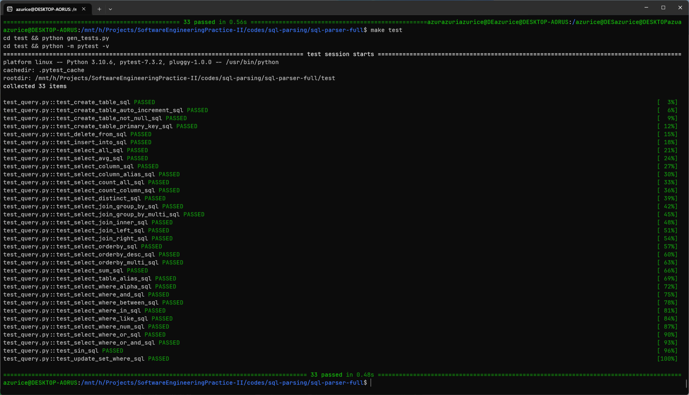

实例具体输出：

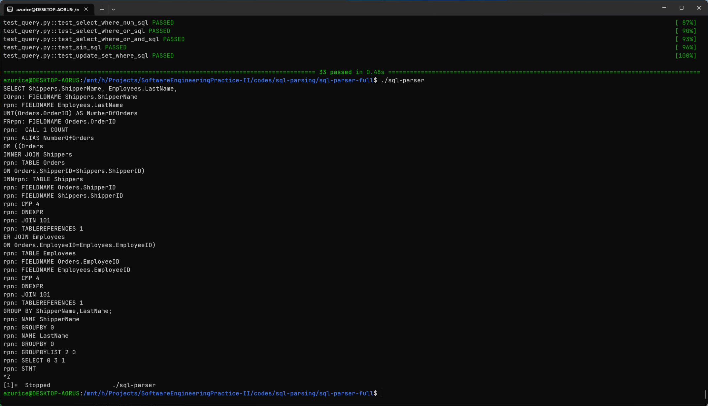

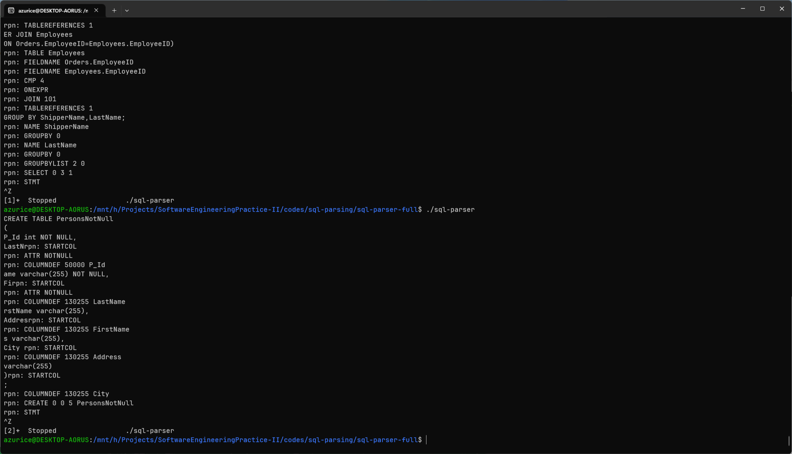

### 4. ANTLR

> `code/sql-parsing/antlr`

```antlr4
grammar Expr;		
prog:	expr EOF ;
expr:	expr ('*'|'/') expr
    |	expr ('+'|'-') expr
    |	INT
    |	'(' expr ')'
    ;
NEWLINE : [\r\n]+ -> skip;
INT     : [0-9]+ ;
```

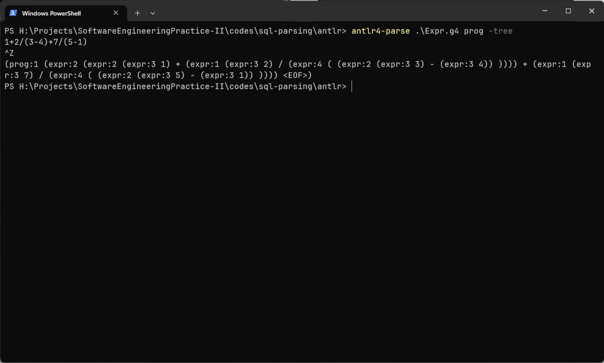

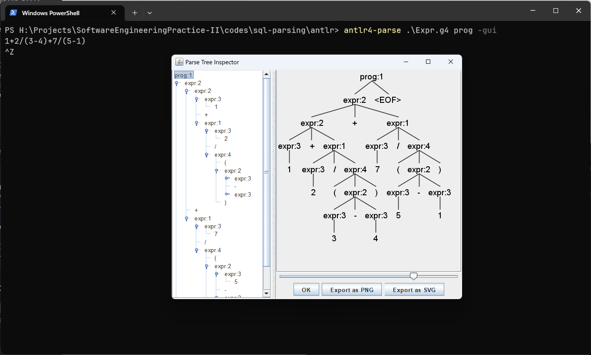

## 项目3：Lock-table based 2PL

> `code/2pl`

### 1. 理解

锁表即一个如下的结构：

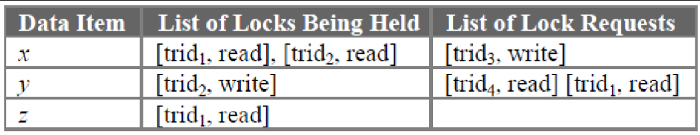

有一个特定的程序用于维护这个锁表，在请求锁的时候检查锁表情况来将其置于 Held 列 或 Requests 列，在事务完成了任务时将锁移除并检查 Requests 列中是否有锁可以移动到 Held 吗，并给予对应事务锁。

---

二段锁即有两个阶段的锁，分别是 Growing Phase 和 Shrinking Phase，在前一个阶段事务仅请求获得新的锁而不释放锁，在后一个阶段事务仅释放锁而不请求获得新的锁。

---

死锁检测：

在每次添加一个锁的时候若无法直接获取锁（即无法直接插入 Held 列）则更新一个当前事务依赖的事务列表。每一个事务都维护着这样的一个列表，那么进行一次 DFS 则可判断是否存在环路。

在每次请求锁的时候通过检查插入后是否有环即可判断是否出现死锁。若出现死锁则将其中一个事务的锁全部收回并将其重启。

### 2. 代码讲解

锁类型 `LockType.go`：

```go
package main

import (
    "math/rand"
)

// LockType -> read | write
type LockType int

const (
    ReadType LockType = iota
    WriteType
)

func (t LockType) String() string {
    switch t {
    case ReadType:
        return "ReadType"
    case WriteType:
        return "WriteType"
    }
    return "Unknown"
}

func RandLockType() LockType {
    return LockType(rand.Int() % 2);
}

```

为了便于使用封装了一个列表 `task_list.go:7`（省略了部分代码）：

```go
type TaskList struct {
    tasks []*Task;
    sz    int
}

func (l *TaskList) Add(task *Task)
func (l *TaskList) Remove(task *Task)
func (l *TaskList) Size() int
func (l *TaskList) get(i int) (*Task, error)
func (l *TaskList) HasWriteType() bool
func (l *TaskList) Has(targetTask *Task) bool
```

每个 Transaction 内可以包含多个 Task `task.go:10`：

```go
type Task struct {
    TransactionId int
    Id     int
    Target int
    Type   LockType
    Time   time.Duration
    ReqResChan chan int
}
```

Transaction 结构如下 `transaction.go:18`（省略了部分代码）：

```go
// Transaction
type Transaction struct {
    Id        int
    Tasks     []*Task
    DependTransactions []*Transaction
}

// 添加、删除依赖 Transaction
func (t *Transaction) AddDep(depTr *Transaction)
func RemoveDep(depTr *Transaction)
// 检测环
func (t *Transaction) circle(first bool, targetTransaction *Transaction) bool {
    if !first && t == targetTransaction {
        return true
    }
    for _, dependTransaction := range t.DependTransactions {
        if dependTransaction == nil {
            continue
        }
        if dependTransaction.circle(false, targetTransaction) {
            return true
        }
    }
    return false
}
// 重启
func (t *Transaction) restart() {
    debug()
    for _, task := range t.Tasks {
        scheduer.cancelReqTask(task)
        scheduer.cancelTask(task)
    }
    t.DependTransactions = make([]*Transaction, 0)
    RemoveDep(t)
    // time.Sleep(1 * time.Second)
    debug()
    t.WaitToStart()
}

// Transaction执行
func (t *Transaction) WaitToStart() {
    <- startSignal // A Signal to start all Transactions
    log.Println(cyan(fmt.Sprintf("Transaction %v growing phase📈", t.Id)))
	// Growing Phase，在这个阶段只请求获得新的锁而不释放锁
    for _, task := range t.Tasks {
        fmt.Printf("[WaitToStart] Transaction %v - Target %v %s %v\n", t.Id, task.Target, magenta("getting lock"), task.Type)
        scheduer.reqChan <- task
        res := <- task.ReqResChan // Will block until it's closed
        if res != 1 {
            fmt.Printf(fgRed("[WaitToStart] Transaction %v: Detected deadlock, restarting...\n", t.Id))
            t.restart()
            return
        }
        // fmt.Printf("Transaction %v - Target %v %s\n", t.Id, task.Target, magenta("geted lock"))
    }

    log.Println(cyan(fmt.Sprintf("Transaction %v shrinking phase📉", t.Id)))
	// Shrinking Phase，在这个阶段只请求释放锁而不请求获得新的锁，挨个执行每个 Task
    for _, task := range t.Tasks {
        fmt.Printf("Transaction %v - Target %v %s %v\n", t.Id, task.Target, bgYellow("start"), task.Type)
        time.Sleep(task.Time)
        fmt.Printf("Transaction %v - Target %v %s %v\n", t.Id, task.Target, bgGreen("done"), task.Type)
        scheduer.doneChan <- task
    }
    log.Println(cyan(fmt.Sprintf("Transaction %v done ✅", t.Id)))
    doneChan <- 1
    // wg.Done()
    // cnt--;
}

```

维护锁表的核心逻辑 `scheduer.go`：

```go
package main

import (
	"fmt"
	"log"
)

type Scheduer struct {
    heldTable [64]TaskList;
    reqTable  [64]TaskList;

    reqChan chan *Task
    doneChan chan *Task
}

func NewScheduer() *Scheduer {
    return &Scheduer{
        [64]TaskList{},
        [64]TaskList{},
        make(chan *Task),
        make(chan *Task),
    }
}

func (s *Scheduer) cancelTask(t *Task) {
    if s.heldTable[t.Target].Has(t) {
    fmt.Printf("Canceling task: %v\n", t)
        s.finishTask(t)
    }
}

func (s *Scheduer) cancelReqTask(t *Task) {
    fmt.Printf("Canceling task: %v\n", t)
    s.reqTable[t.Target].Remove(t)
}

func (s *Scheduer) addTask(t *Task) {
    if s.heldTable[t.Target].Size() != 0 && (t.Type == WriteType || s.heldTable[t.Target].HasWriteType()) {
        for i := 0; i < s.heldTable[t.Target].Size(); i++ {
            task, _ := s.heldTable[t.Target].get(i)
            // Update the Dependencies
            transactions[t.TransactionId].AddDep(transactions[task.TransactionId])
        }
        // Check if circled
        if transactions[t.TransactionId].circle(true, transactions[t.TransactionId]) {
            t.ReqResChan <- 0 // DeadLock
            return
        }
        s.reqTable[t.Target].Add(t)
    } else {
        fmt.Printf("[addTask] Transaction %v - Target %v %s %v\n", t.TransactionId, t.Target, magenta("getted lock"), t.Type)
        s.heldTable[t.Target].Add(t)
        t.ReqResChan <- 1
    }
}

func (s *Scheduer) finishTask(t *Task) {
    s.heldTable[t.Target].Remove(t)
    fmt.Printf("Transaction %v - Target %v %s %v\n", t.TransactionId, t.Target, magenta("released lock"), t.Type)
    // fmt.Println("finished: ", t)
    // fmt.Println(s.reqTable[t.Target])

    if s.reqTable[t.Target].Size() == 0 {
        return
    }

    firstReqTask, _ := s.reqTable[t.Target].get(0)
    if firstReqTask.Type == WriteType {
        fmt.Printf("Transaction %v - Target %v %s %v\n", firstReqTask.TransactionId, firstReqTask.Target, magenta("getted lock"), firstReqTask.Type)
        s.reqTable[t.Target].Remove(firstReqTask)
        s.heldTable[t.Target].Add(firstReqTask)
        firstReqTask.ReqResChan <- 1
        return
    }
    for i := 0; i < s.reqTable[t.Target].Size(); i++ {
        reqTask, _ := s.reqTable[t.Target].get(i)
        if reqTask.Type == WriteType {
            continue
        }
        fmt.Printf("Transaction %v - Target %v %s %v\n", firstReqTask.TransactionId, firstReqTask.Target, magenta("getted lock"), firstReqTask.Type)
        s.reqTable[t.Target].Remove(reqTask)
        s.heldTable[t.Target].Add(reqTask)
        reqTask.ReqResChan <- 1
        return
    }
}

func (s *Scheduer) tick() {
    for {
        select {
        case task := <- s.reqChan:
            log.Printf("[scheduer]: Get task request: %v\n", task)
            scheduer.addTask(task)
        case task := <- s.doneChan:
            log.Printf("[scheduer]: Get task done: %v\n", task)
            scheduer.finishTask(task)
        // default:
        //     fmt.Println(cnt)
        //     time.Sleep(2 * time.Second)
        }
    }
}

```


### 3. 效果展示

随机生成 10 个事务：

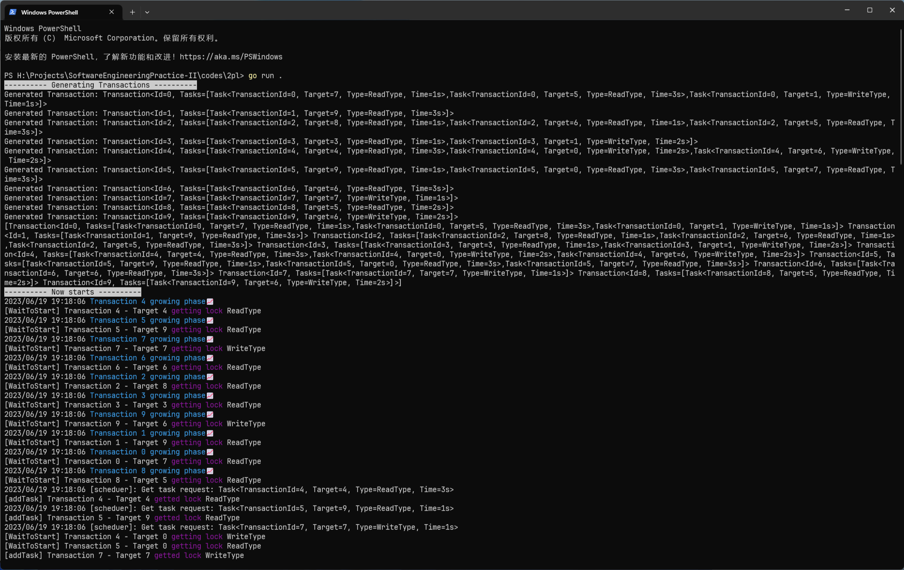

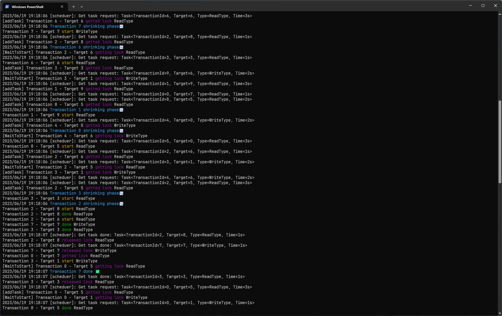

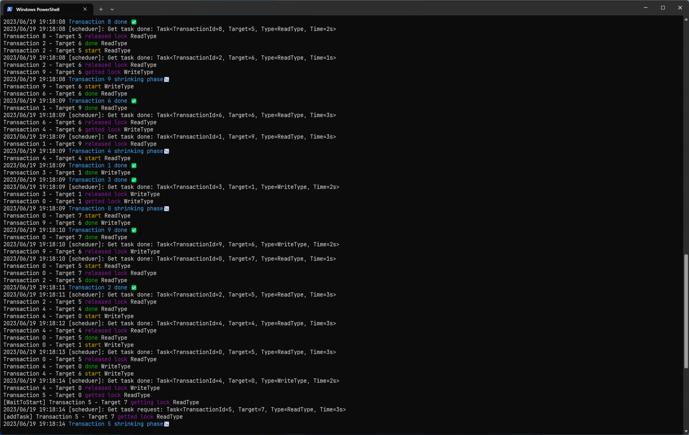

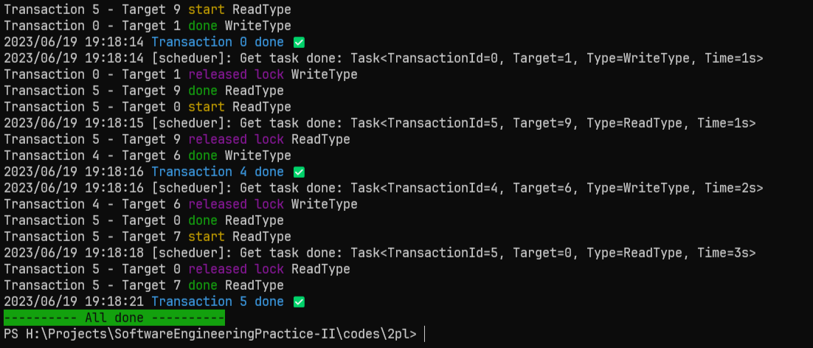

---

带有死锁的一个例子：

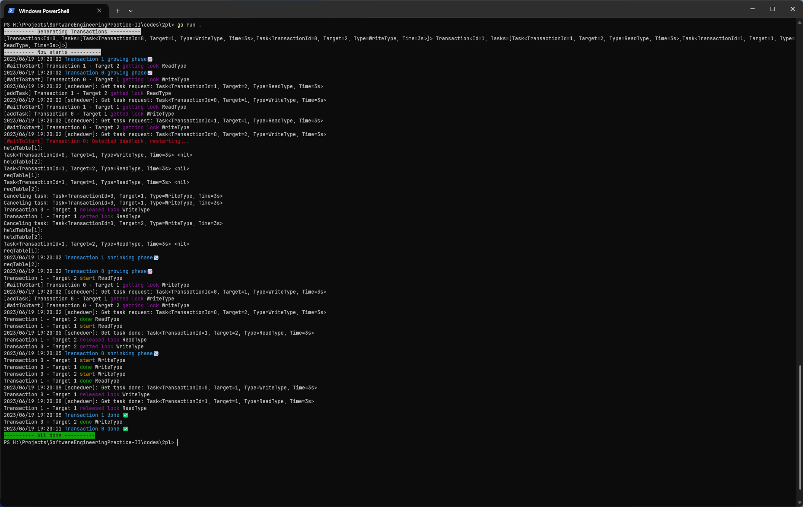


## 项目4：Web

> `code/web`

### 1. 理解

#### > 项目构成

前端基于 nodejs +HTML + CSS 采用 svelte 框架和 typescript。

使用了 svelte 的 smui 组件库，以及原子化 CSS 框架 unocss。

构建出静态页面。

后端基于 Golang，前端构建出的静态页面通过 statik 库嵌入到 go 构建出的二进制文件中，使用 gin 框架搭建路由、http handler 等。

前端通过 axios 库发送 http 请求与后端交流。

---

#### > 三层架构

**MVC** 全称 Model-View-Controller，正如名称所示，将整个应用的结构拆分为三层：

- Model：负责数据
- Controller：负责数据交互、响应请求
- View：负责视图

前端完成 View 的部分，其余部分交给后端。

而后端将逻辑细分，可以分出了如下几层：

- router：路由
- controller：核验数据、参数是否合法
- service：从 model 层拿到数据再返回
- model：与数据库进行数据交互

而我的实现通过接口的方式自动实现了 controller 与 service 之间的映射，详细见代码讲解。

#### > 登录控制

登陆验证通常有以下几种方法

1. 基于 cookie

   在基于 cookie 的身份验证中，当用户成功登录后，服务器会将带有身份验证信息的 cookie 发送给客户端。以后访问该网站时，客户端的浏览器会自动发送该 cookie，无需用户重新登录。

   与 Session 不同，Cookie 在客户端存储，可以在浏览器关闭和重新启动后继续发送。Cookie 传递的信息通常是编码为 Base64 或加密的，但 Cookie 本身不安全，可能会被客户端或第三方窃取。

2. 基于 session 和 cookie

   基于 session 的认证是指当用户首次登录成功后，服务器将为用户创建一个 session，为其分配一个唯一的 session ID 并将该 ID 储存在 cookie 中。删除 cookie 时，session ID 也会被删除。

   之后，用户请求服务器时会将该 session ID 与其发送至服务器。服务器使用该 session ID 来查找服务器中的 session 数据，并以此进行身份验证。 session 通常会在服务器端存储，它可以在服务器重启后恢复并保持用户状态。

3. 基于 JWT Token 和 localStorage

   JWT Token由三个部分组成：头部，负载和签名。头部包含加密算法和token类型；负载是包含身份验证信息的 JSON 数据；签名用于验证 token 的有效性和完整性。

   当用户首次登录成功后，服务器会使用某些算法为其分配一个 JWT Token。可以在前端将此 token 存储在浏览器的 localStorage 或 sessionStorage 中。以后，用户每次请求服务器时，在请求头中包含该 JWT Token，服务器使用同样的算法验证 Token 的有效性和完整性，并依此进行身份验证。由于 Token 被加密和签名，客户端无法自行修改。

   基于 JWT Token 的验证方法相对于 session 和 cookie 更为灵活，因为服务器不必在每个用户会话中存储状态。这使得 JWT 成为一种使用频率较高的验证方案。

总的来说，基于 session 和基于 cookie 依赖于服务器存储状态，而基于 JWT Token 不需要存储状态。

选择了基于 JWT Token 的方式。

#### > 使用 哈希 + 加盐 存储密码加强安全性

##### 1）明文

用户名和密码以明文方式存储在数据库中，若数据库被拿下，那么攻击者就可以直接拿到所有人的密码。

```
|User|Password|
|  1 |  P(1)  |
|  2 |  P(2)  |
|  3 |  P(3)  |
```

##### 2）使用哈希算法

哈希算法的本质是对数据进行一个不重复的单射。

```
P(1) -> P'(1)
P(2) -> P'(2)
P(3) -> P'(3)
...
```

服务端只存储经过哈希后的密码。客户端在登陆时发送原本的密码，并在服务端使用同样的哈希算法计算，与哈希后的密码进行比对。

```
|User|HashedPassword|
|  1 |     P'(1)    |
|  2 |     P'(2)    |
|  3 |     P'(3)    |
```

这样，若数据库被拿下，攻击者拿到的是 P'，而 P' 不能被直接拿来登录（因为 P' 经过一次哈希 不能依然等于 P'），同时也不能反向求得 P。
如此，攻击者必须枚举 P，直至找到一个使用相同哈希算法正向计算后结果与 P' 相同的 P，才是真正的密码。

但是众所周知，万物皆可打表。
作为人类，大多数人设置的密码都缺乏随机性，比如姓名缩写+生日、更有甚者就是一个 `123456`。攻击者可以使用一个庞大的常见密码库并使用相同的哈希算法预先计算出一大张表，直接与 P' 进行匹配。

##### 3）加盐

将不同用户的密码附加上不同的随机串来形成新的密码，保存对这个密码进行哈希的结果作为存储的密码。（不同的盐值也保存在服务端中）

```
S(1) + P(1) -> SP(1) -> SP'(1)
S(2) + P(2) -> SP(2) -> SP'(2)
S(3) + P(3) -> SP(3) -> SP'(3)
...
```

这样，一来增强了用户密码的随机性，提高了打表难度，
另一方面攻击者计算出的一张表只能针对一个盐值，将对群体的攻击转化为了对一个个体的攻击，大大增加了攻击代价。

```
|User| Salt |HashedPasswordWithSalt|
|  1 | S(1) |        SP'(1)        |
|  2 | S(2) |        SP'(2)        |
|  3 | S(3) |        SP'(3)        |
```

#### > ORM

ORM 全称 Object Relation Mapping（对象关系映射）是一种将面向对象编程语言和关系数据库之间数据的相互转换的技术。ORM 通过将对象映射到关系数据库中的表、行和列，将面向对象的数据模型与关系型数据库之间建立了一种自动化映射。

ORM 技术将应用程序中的对象与关系数据库进行映射，开发人员只需编写使用对象的代码，而不必先编写复杂的 SQL 语句，从而节省了开发时间和成本，还提高了代码可读性和可维护性。

ORM 技术可以自动执行以下任务：

1. 建立对象和数据库表之间的映射关系
2. 自动创建表和修改表结构
3. 自动生成 SQL 语句，从而避免了开发人员需要编写复杂的 SQL 语句
4. 将表记录映射为对象实例，从而将编程语言中的对象直接与数据库进行交互

而由于本项目是数据库课程的实训项目，为了锻炼 SQL 的编写能力，并没有直接使用现成的 ORM 库（比如 Gorm），而是阅读了部分 Gorm 的源码，并结合自己的理解手搓了简单的 ORM 功能。

### 2. 代码讲解

#### > 三层架构的简化

通过设计 Service 接口 `server/service/service.go:13`：

```go
type Service interface {
	Handle(c *gin.Context) (any, error)
}

// Handler is a controller bridge between router and service
func Handler(s Service) gin.HandlerFunc {
	return func(c *gin.Context) {
		// First bind the JSON to the service
		err := c.ShouldBindJSON(s)
		if err != nil && err != io.EOF {
			c.JSON(http.StatusBadRequest, serializer.ErrorResponse(err))
			return
		}

		// Then invoke the Handle method of the server
		res, err := s.Handle(c)
		if err != nil {
			log.Println(err.Error())
			c.JSON(http.StatusBadRequest, serializer.ErrorResponse(err))
		} else {
			log.Println("StatusOK")
			c.JSON(http.StatusOK, serializer.Response(res))
		}
	}
}

```

将原本 controller 层要完成的工作自动完成（核验数据、参数是否合法），于是可以直接在 router 层便捷地通过在满足 Service 接口的类型外套一个 `Handler` 方法直接生成 controller 代码，路由代码如下 `server/router.go:12`：

```go
func InitRouter() *gin.Engine {
    r := gin.Default()

	config := cors.DefaultConfig()
	config.ExposeHeaders = []string{"Authorization"}
	config.AllowCredentials = true
	config.AllowAllOrigins = true
	config.AllowHeaders = []string{"Origin", "Content-Length", "Content-Type", "Authorization"}
	r.Use(cors.New(config))

    // static file middleware
    r.Use(middlewares.Frontend(bootstrap.StaticFS))
    api := r.Group("api")
    {
        // No login required
        user := api.Group("user")
        {
            // Login Service
            user.POST("login", service.Handler(&service.LoginService{}))
            // Register Service
            user.POST("register", service.Handler(&service.RegisterService{}))
        }

        auth := api.Group("")
        auth.Use(middlewares.JWTAuth())
        {
            // course
            course := auth.Group("course")
            {
                course.POST("", service.Handler(&service.CreateCourseService{}))
                course.PUT("", service.Handler(&service.UpdateCourseService{}))
                course.GET("", service.Handler(&service.GetCoursesService{}))
                course.GET("joined", service.Handler(&service.GetJoinedCoursesService{}))
                course.GET("created", service.Handler(&service.GetCreatedCoursesService{}))
                course.POST("join", service.Handler(&service.JoinCourseService{}))
                course.POST("exit", service.Handler(&service.ExitCourseService{}))
            }

            auth.POST("sql", service.Handler(&service.SQLService{}))
        }
    }

    return r
}
```

#### > 手搓 ORM

在 Golang 中是支持 reflect 功能的，可以通过 reflect 库在运行时动态地探索和操作对象的类型、值和结构。使用 reflect 可以访问 struct 的字段、方法、函数等。

此外 Golang 的 struct 有一个特殊的功能 叫做 Struct Tag：

```go
type User struct {
    ID        int    `sqlType:"serial" sql:"PRIMARY KEY" json:"id"`
    Username  string `sql:"NOT NULL CHECK (username <> '')" json:"username"`
    Nickname  string `sql:"NOT NULL CHECK (nickname <> '')" json:"nickname"`
    Password  string `sql:"NOT NULL" json:"-"`
    Usergroup int    `sql:"CHECK (usergroup BETWEEN 0 AND 3)" json:"usergroup"`
}
```

比如上述代码每个字段右侧用反引号包裹的部分即为 Struct Tag。

我实现的 ORM 基于 reflect 建立了 **结构体名称** 与 **表名** 之间的映射以及 **结构体字段名和类型** 与表 **列名和列类型** 之间的映射，并通过 reflect 读取 **Struct Tag** 实现了额外的 **约束条件** 的添加。

驼峰命名与下划线分割名称的转换 `internal/utils/utils.go:11`：

```go
var matchFirstCap = regexp.MustCompile("(.)([A-Z][a-z]+)")
var matchAllCap   = regexp.MustCompile("([a-z0-9])([A-Z])")

// ToSnakeCase turn the string to snake case
func ToSnakeCase(str string) string {
    snake := matchFirstCap.ReplaceAllString(str, "${1}_${2}")
    snake  = matchAllCap.ReplaceAllString(snake, "${1}_${2}")
    return strings.ToLower(snake)
}
```

类型映射 `internal/db/type_mapping.go:8`：

```go
func GetSQLType(field reflect.StructField) string {
    var sqlType string
    if sqlType = field.Tag.Get("sqlType"); len(sqlType) == 0 {
        switch field.Type.Kind() {
        case reflect.Bool:
            sqlType = "bool"
        case reflect.Int8, reflect.Uint8, reflect.Int16, reflect.Uint16:
            sqlType = "smallint"
        case reflect.Int32, reflect.Uint32:
            sqlType = "integer"
        case reflect.Int, reflect.Int64, reflect.Uint, reflect.Uint64:
            sqlType = "bigint"
        case reflect.Float32:
            sqlType = "real"
        case reflect.Float64:
            sqlType = "double precision"
        case reflect.String:
            sqlType = "text"
        default:
            if field.Type == reflect.TypeOf(time.Time{}) {
                sqlType = "timestampz"
            }
            // TODO
        }
    } else {
        if sqlType == "serial" {
            switch field.Type.Kind() {
            case reflect.Int8, reflect.Uint8, reflect.Int16, reflect.Uint16:
                sqlType = "smallserial"
            case reflect.Int32, reflect.Uint32:
                sqlType = "serial"
            case reflect.Int, reflect.Int64, reflect.Uint, reflect.Uint64:
                sqlType = "bigserial"
            }
        }
    }
    return sqlType
}
```

建表、查询、更新、删除等 `internal/db/database.go:66`（代码过长，此处仅列出关键方法签名）：

```go

// ------ ↓ ORM ↓ ------

// Base on the type of the argument
// the type of `value` should be the pointer of a struct

// CreateTable creates tables based on the type of each one value of values if not exist
func (db *DBHelper) CreateTable(value any) error

// Insert inserts value to the corresponding table according to its type
// cols represents the columns should be used (empty for using all fields)
func (db *DBHelper) Insert(value interface{}, cols ...string) (sql.Result, error)

func (db *DBHelper) Update(value interface{}, primaryKey int, cols ...string) (sql.Result, error)

func (db *DBHelper) Delete(dest interface{}, conds ...interface{}) (sql.Result, error)

// First
// dest: the pointer to a struct
// conds:
//
//	if it only contains a integer: primary key
//	if it only contains a string: query str
//	if it contains many string:
//	  conds[0]: query: query str
//	  conds[1:]: args: query args
func (db *DBHelper) First(dest interface{}, conds ...interface{}) error

// dest is the pointer of a empty slice
func (db *DBHelper) Query(dest interface{}, conds ...interface{}) error
```

所有操作均被封装为了基于传入对象类型的方法，Insert、Update、Delete 会基于传入的 `value` 在对应表进行修改，Query 会基于 dest 的类型在对应表查询并将结果存入 dest。

然后使用这套框架即可高度简化各个服务的代码 `server/service/*.go`，下面以创建课程方法 `server/service/course.go:11` 为例：

```go
type CreateCourseService struct {
	Name        string `form:"name"`
	Description string `form:"description"`
	IsPrivate   bool   `form:"is_private"`
}

func (s *CreateCourseService) Handle(c *gin.Context) (any, error) {
    // Get id of the current user

    id := c.GetInt("id")

	course := &models.Course{
        CreaterID:   id,
		Name:        s.Name,
		Description: s.Description,
		IsPrivate:   s.IsPrivate,
	}

	res, err := bootstrap.DB.Insert(course)
	if err != nil {
		log.Printf("[CreateCourseService]: Error %v\n", err)
		return nil, err
	}
	log.Printf("[CreateCourseService]: Service created %v\n", res)

	return nil, nil
}
```

再比如用户登录 `server/service/user.go:39`：

```go
type LoginService struct {
    Username string `form:"username"`
    Password string `form:"password"`
}

func (s *LoginService) Handle(c *gin.Context) (any, error) {
    var err error
    user := &models.User{}
    log.Println("[LoginService/Handle]: Getting first record that matches the username...")
    if err = bootstrap.DB.First(user, "username LIKE $1", s.Username); err != nil {
        return nil, err // User not exist
    }
    log.Printf("[LoginService/Handle]: User: %v\n", user)

    log.Println("[LoginService/Handle]: Checking password...")
    if err := user.CheckPassword(s.Password); err != nil {
        return nil, err
    }
    log.Println("[LoginService/Handle]: Password correct")

	var jwtToken string
	jwtToken, err = jwt.CreateToken(user.ID, user.Usergroup)

	res := make(map[string]any)
	res["token"] = jwtToken
	res["user"] = user
	// res["user_name"] = user.Username

	return res, nil
}

```

#### > 后端存储密码 哈希 + 加盐 与 JWT

上面已经展示了用户登陆部分代码，会从数据库中取出对应用户的盐值并使用相同的加密算法对传入的密码进行加密，再将结果与数据库中的值进行对比，如果正确，则生成一个 JWT token 传给客户端

### 3. 效果展示

注册：

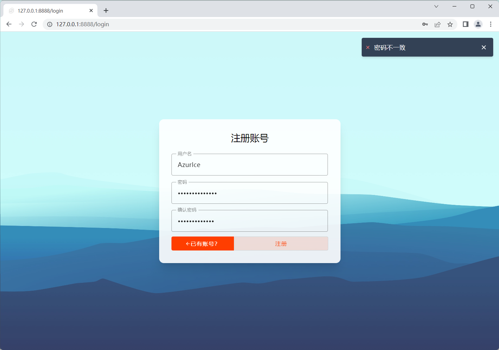


登录：

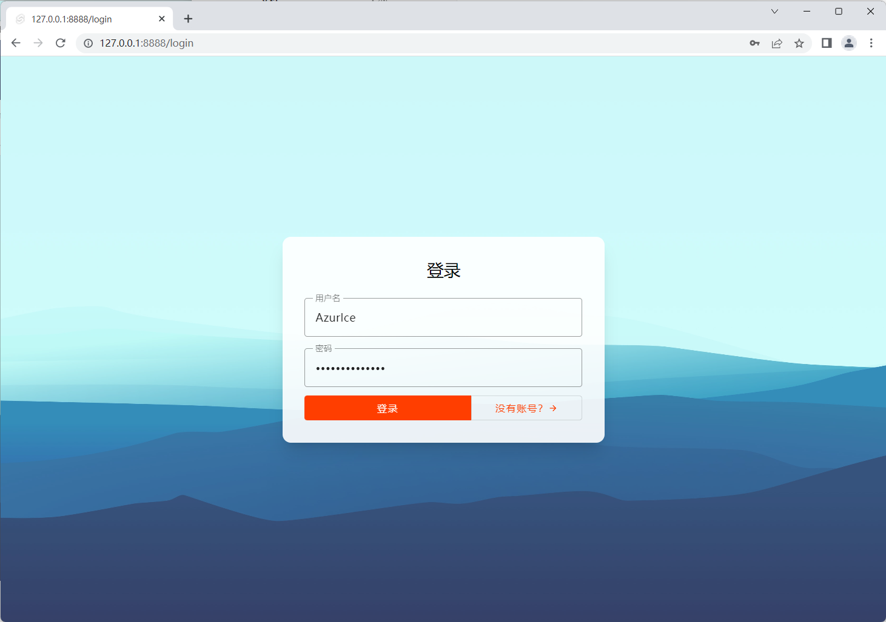

首页：

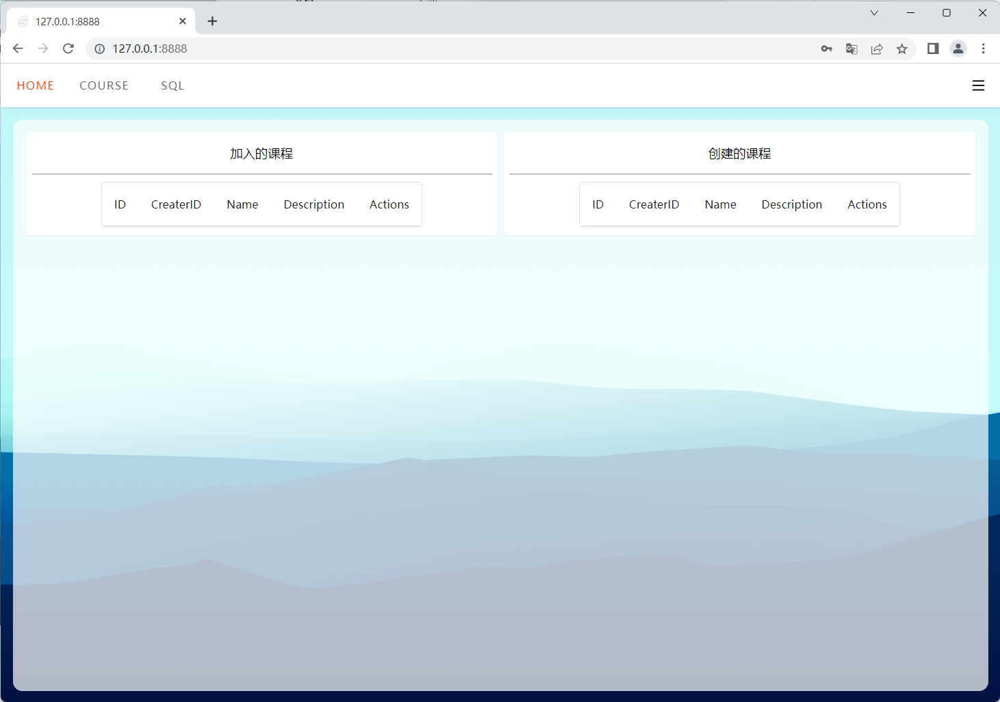

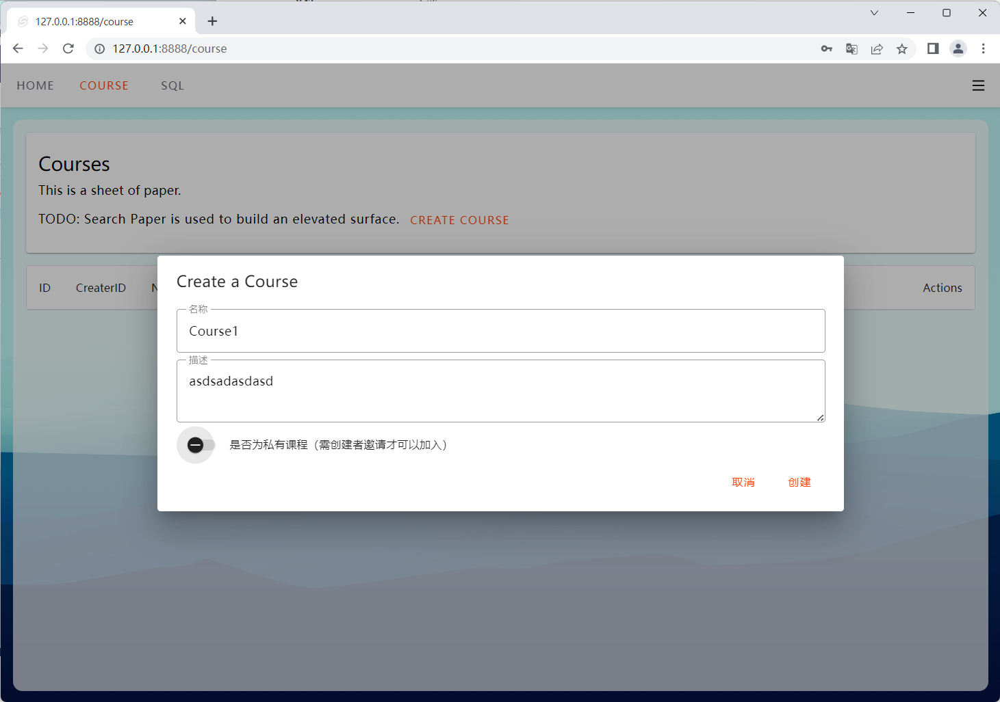

（私有课程功能没有实际实现）

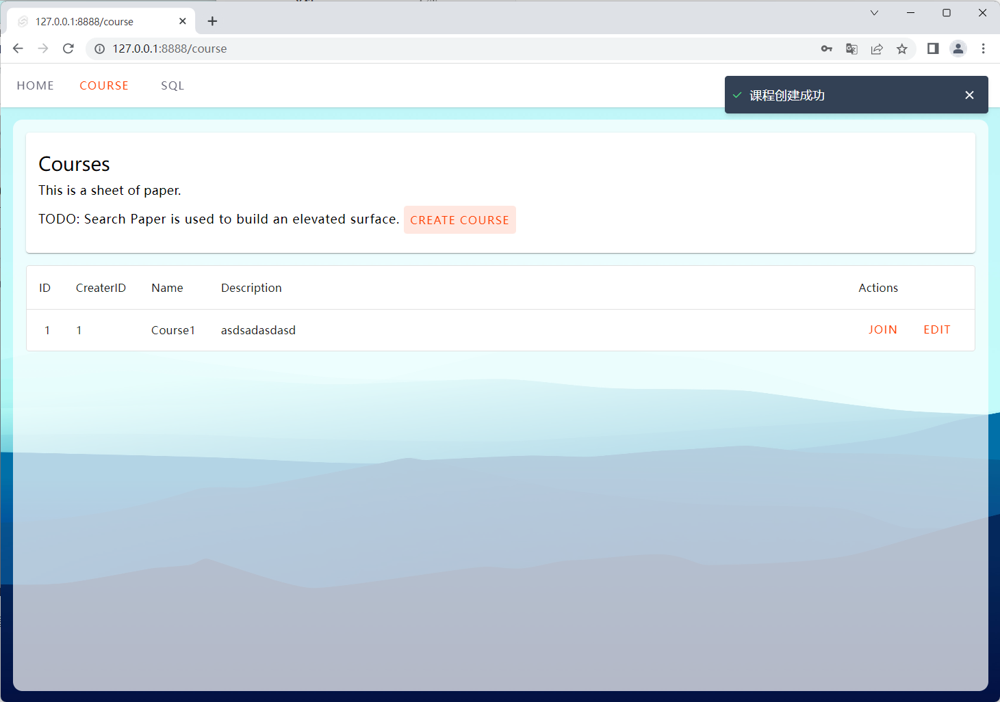

加入课程：

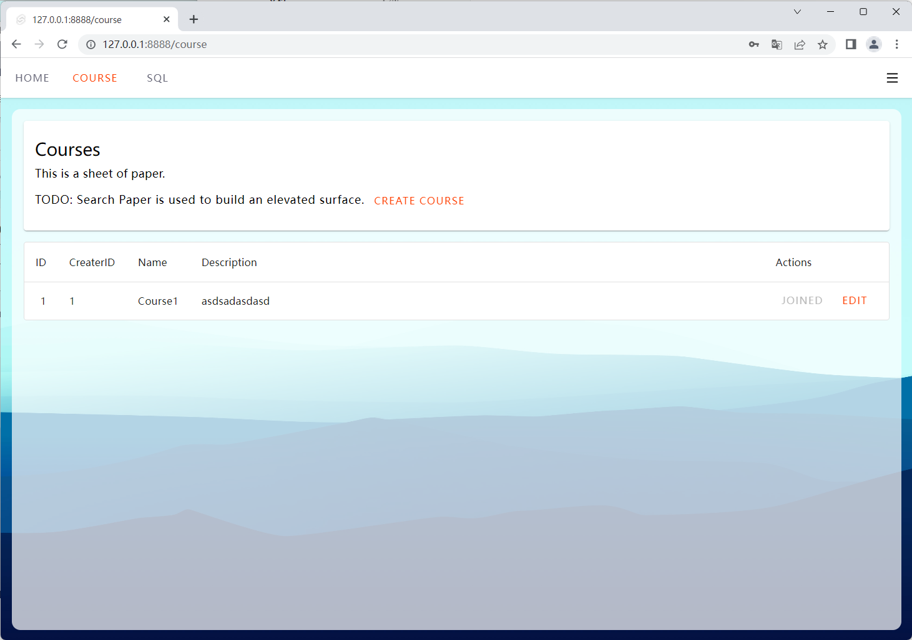

修改课程：

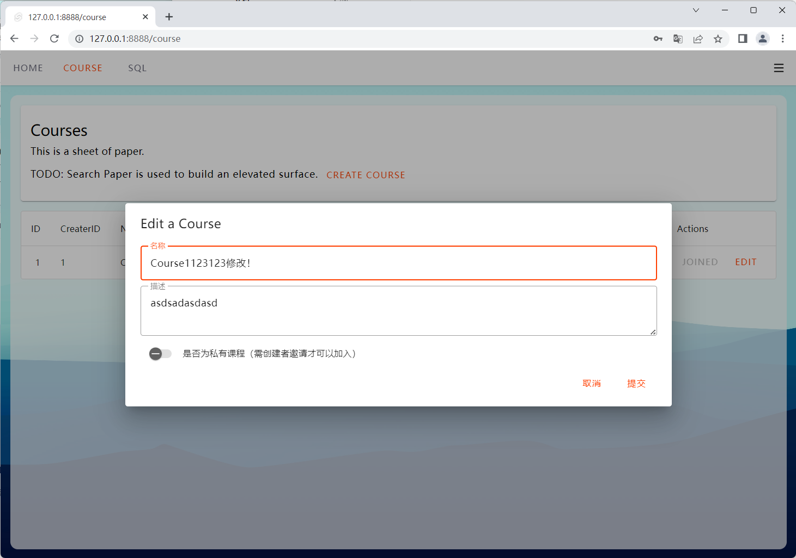

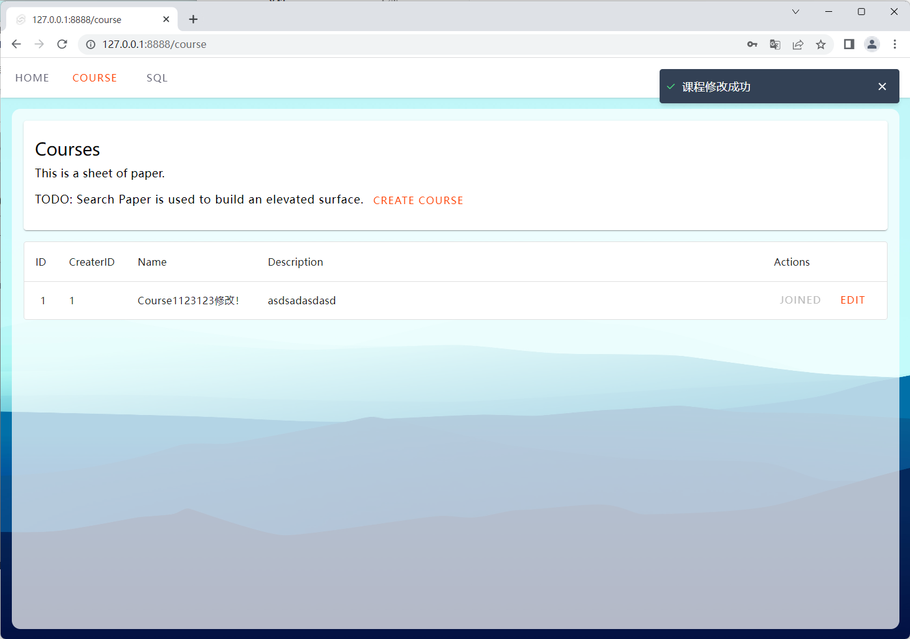

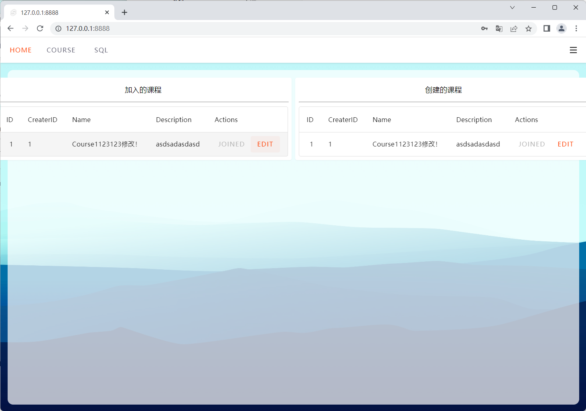

SQL 执行：

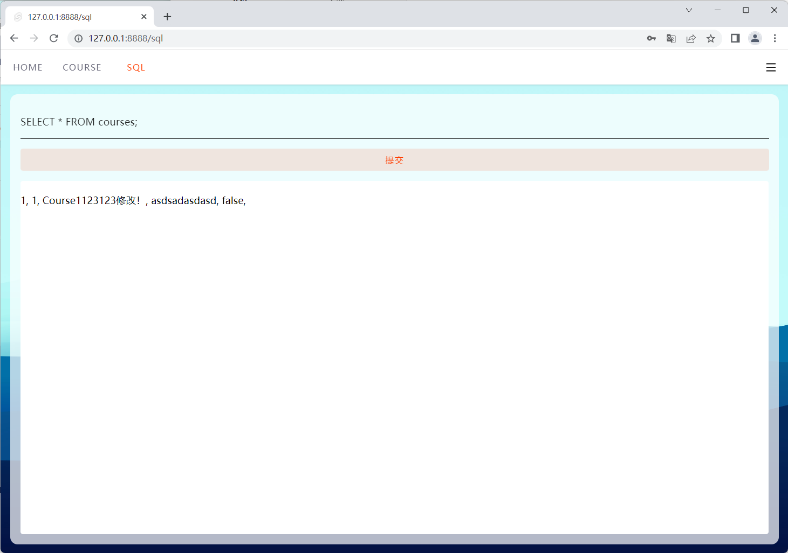

退出课程：

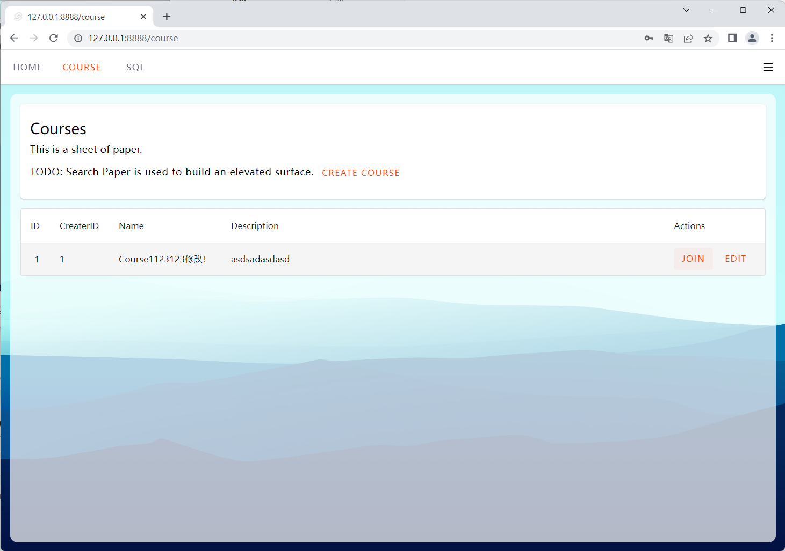